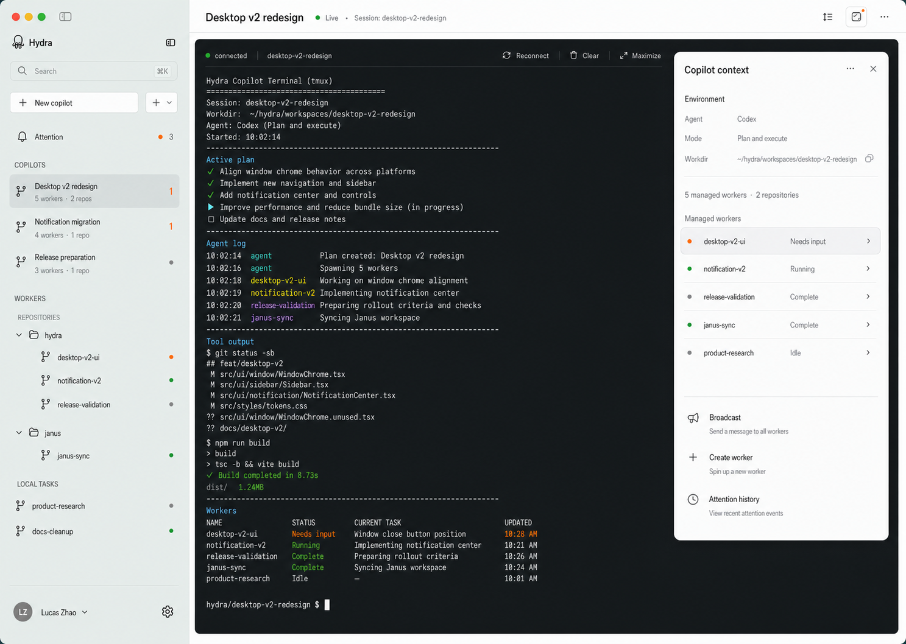
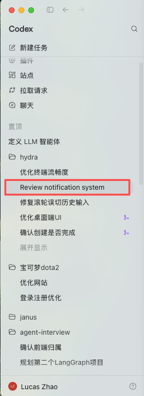
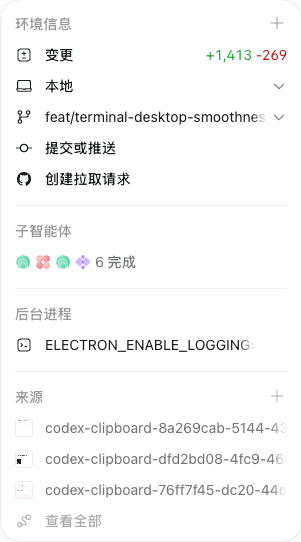
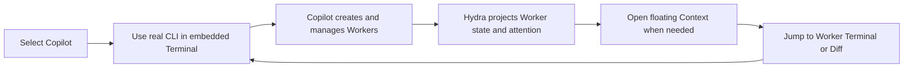
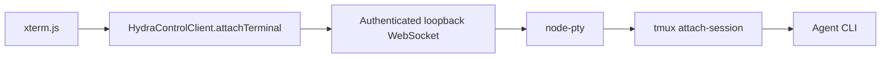

# Hydra Desktop v2 — Terminal-First Product Design

**Status:** Approved; production-density amendment frozen for implementation<br>
**Decision date:** 2026-07-11<br>
**Density amendment:** 2026-07-12<br>
**Integration branch:** `feat/desktop-v2-terminal-first`<br>
**Applies to:** `packages/desktop` renderer UX and the protocol fields required by it

This document is the product and interaction source of truth for the Hydra
Desktop v2 frontend. When an implementation detail conflicts with this document,
the implementation must be changed or this document must go through explicit
product change control. Do not silently drift back to a dashboard-first or
conversation-reimplementation design.

It supplements the process and transport architecture in
[`docs/desktop-app/FINAL.md`](../desktop-app/FINAL.md) and the runtime and
notification contracts in
[`docs/worker-attention-control-plane-plan.md`](../worker-attention-control-plane-plan.md).

## 1. Approved visual anchors



The image above freezes the product composition and hierarchy. Its terminal
content is illustrative. Production UI must use live Hydra and agent data and
must not fabricate unsupported metrics or activity.

The initial image-generated anchor was intentionally superseded for density,
palette, and disclosure behavior after comparison with the production Codex
desktop surfaces below:

| Production density reference | Use |
|---|---|
|  | Sidebar neutral palette, compact rows, `Show more`, and 40–44 px footer |
|  | Compact floating-inspector typography, separators, and action rhythm |

Red outlines in the supplied Sidebar capture are reviewer annotations, not UI.
Hydra keeps its own product hierarchy, controls, and brand; these captures
override the generated anchor only where the earlier mock was visibly too
large or too blue-green.

### Visual direction

Hydra follows the calm, precise desktop language established by Codex without
copying Codex branding or product hierarchy:

- warm off-white application canvas;
- neutral cool-gray translucent sidebar sampled near `#d8dfde` after compositing;
- compact native typography and monochrome line icons;
- hierarchy from spacing, alignment, and hairline separators before cards;
- sparse orange for attention, not for decoration;
- one dark terminal work surface;
- restrained rounding and one soft shadow only for floating surfaces;
- no dashboard card grid, large KPI blocks, gradients, glossy effects, or
  decorative status colors.

### Pixel-fidelity contract

The approved sources are visual truth, not loose mood boards. Live business
values may differ, but shell geometry, spacing, typography, icon placement,
surface colors, radii, borders, and shadows must match. The canonical renderer
state is a 1280 × 800 default window with a selected Copilot and Context open:

| Surface | Frozen geometry |
|---|---:|
| Sidebar / main boundary | x = 296 px; resizable 228–320 px |
| Session header | x = 296 px, h = 54 px |
| Terminal workspace inset | 9 / 10 / 12 / 16 px left / top / right / bottom |
| Terminal utility line | 45 px high |
| Context, one tab | x = 940 px, y = 72 px, w = 320 px, max-h = 712 px |
| Context, tab bar visible | x = 940 px, y = 114 px, w = 320 px, max-h = 670 px |
| Copilot / Worker row | 44 / 34 px minimum height |
| Context managed-Worker row | 40 px minimum height |
| Sidebar footer | 44 px high |

Native macOS traffic lights remain OS-rendered through Electron
`hiddenInset`; renderer-only screenshots normalize that native chrome out of
the comparison. A passing implementation must retain the reference content
geometry and separately verify the native packaged window.

## 2. Product thesis

Hydra Desktop is a command center for long-lived Copilots and the Workers they
orchestrate. The user primarily communicates with a Copilot through its real
agent CLI. Hydra adds fleet navigation, durable attention, worker context, and
diff review around that CLI.

The v2 primary loop is:



## 3. Frozen product decisions

These decisions are approved for v2 and must not be reopened during ordinary
implementation:

1. **Terminal-first center.** The selected Copilot's full-fidelity CLI Terminal
   is the central primary workspace.
2. **No v2 Conversation page.** Hydra does not reimplement agent chat,
   transcript, tool-call, or plan UI in the first v2 release.
3. **Copilots are top-level and cross-repo.** They are never nested under a
   repository.
4. **Workers are a separate top-level section.** Code Workers are grouped by
   repository; directory Workers are grouped under Local Tasks.
5. **No duplicated Worker rows.** A Worker may reference its parent Copilot but
   appears only once in the authoritative Worker tree.
6. **Context is a floating drawer.** Opening it overlays the terminal and does
   not change terminal geometry.
7. **Copilot has no Terminal/Conversation toggle.** Its center is always the
   Terminal.
8. **Worker has Terminal/Diff switching.** Diff is applicable only to code
   Workers; Local Tasks remain Terminal-only unless a future artifact surface
   is explicitly designed.
9. **Attention is Hydra-owned.** Needs-input, error, and completion occurrences
   come from runtime/notification v2 rather than terminal text inference in the
   renderer.
10. **Agent-native history remains native.** A structured cross-agent
    Conversation view is deferred until a separate normalized transcript
    contract is approved.

## 4. Application shell

The window uses two persistent layout regions plus one optional overlay:

| Region | Default | Bounds | Behavior |
|---|---:|---:|---|
| Sidebar | 296 px | 228–320 px | Resizable and persisted; compact-width toggle at narrow widths |
| Main workspace | Remaining width | Minimum 640 px | Session header plus Terminal or Worker Diff |
| Context drawer | 320 px wide, content height | 304 px wide at the minimum viewport; max-height leaves 16 px bottom inset | Floating overlay, no layout reflow |
| Session header | 54 px | Fixed | Identity, live state, context toggle, utility menu |
| Sidebar footer | 44 px | Fixed | Local profile identity and utilities |
| Workspace inset | 9 / 10 / 12 / 16 px | Fixed at reference size | Left / top / right / bottom terminal separation |

The current Electron minimum size of 980 × 640 remains supported. The approved
image is a 1440-class composition, not a new minimum-size requirement.

### Window behavior

- Sidebar resizing changes the available main-workspace width and may resize
  the active terminal.
- Opening or closing Context never resizes the terminal; the drawer overlays it.
- The terminal remains visible beneath the drawer. Users close the drawer when
  they need the obscured columns.
- Window resize uses the existing animation-frame-coalesced terminal fit path.
- The shell remembers sidebar width and Context open/closed state locally.

## 5. Sidebar information architecture

```text
Hydra
├── Search
├── New Copilot
├── +
│   ├── Code Worker
│   └── Local Task
├── Attention
├── COPILOTS
│   ├── Desktop v2 redesign
│   ├── Notification migration
│   └── Release preparation
└── WORKERS
    ├── REPOSITORIES
    │   ├── hydra
    │   │   ├── desktop-v2-ui
    │   │   ├── notification-v2
    │   │   └── release-validation
    │   └── janus
    │       └── janus-sync
    └── LOCAL TASKS
        ├── product-research
        └── docs-cleanup
```

### 5.1 Header controls

- Search filters Copilots and Workers in place. It does not change grouping.
- `New Copilot` is the primary creation action because Copilot is the main user
  interaction object.
- The adjacent `+` menu creates either a Code Worker or a Local Task.
- When a Copilot is selected, creation presets that Copilot as parent but keeps
  the field editable.
- `Attention` shows the count of active needs-input and error occurrences.
  Completion contributes only while it is active and unread.

### 5.2 Copilot rows

A Copilot row contains:

- display name;
- aggregate `N workers · M repos` summary;
- attention count when greater than zero;
- a subtle lifecycle indicator only when stopped or unavailable.

Clicking a Copilot opens or focuses its session and activates its Terminal.
Copilot rows do not expand into a second copy of their Workers. Managed Workers
are summarized in the floating Context drawer.

Only the first five Copilots render by default when the list is long. A compact
`Show more` / `Show less` disclosure follows the production Codex pattern.
Search always reveals all matching rows and temporarily suppresses that
disclosure control.

### 5.3 Worker groups and rows

Code Workers appear under their repository. Directory Workers appear under
Local Tasks. Repository and Local Tasks groups are independently collapsible.
Local Tasks exposes its own visible caret instead of relying only on the parent
Workers section. A long Local Tasks list initially shows four rows and uses the
same `Show more` / `Show less` behavior as Copilots.

A Worker row contains:

- friendly name and optional worker number in secondary text;
- one state dot;
- an attention count only when multiple active occurrences exist;
- changed-file count for code Workers when non-zero;
- parent Copilot in a tooltip or Context detail, not as another hierarchy.

Selected state uses a neutral tint. Needs-input uses a small orange indicator;
error uses red; running uses green; idle and unknown use neutral gray. Text and
accessible labels must always accompany color in expanded/context surfaces.

## 6. Main workspace

### 6.1 Copilot selected

The center contains:

1. a slim session header with display name, live/stopped state, stable session
   label, Context toggle, and overflow menu;
2. a full-height embedded Terminal;
3. no Hydra chat composer, Conversation tab, Activity feed, or duplicate plan
   rendering.

The Copilot CLI remains responsible for its conversation, plan, tool calls,
and native approvals. Hydra does not parse terminal output to render these
elements elsewhere.

### 6.2 Worker selected

Code Workers add a restrained `Terminal | Diff` segmented switch in the session
header. New Worker tabs start on Terminal. Opening a completion action may open
the Worker directly on Diff.

Directory Workers remain Terminal-only. A stopped Worker shows its last known
context in the drawer and a clear `Start worker` action in the main empty state.

### 6.3 Session tabs

Open sessions remain lightweight tabs above or within the session header:

- opening an existing session focuses its existing tab;
- needs-input and error are indicated without taking focus;
- closing a tab detaches its active terminal resources but does not stop the
  tmux session;
- deleting a session prunes its tab;
- the last active Copilot may be restored at application launch;
- Overview is replaced by the terminal-first session landing behavior once at
  least one Copilot exists.

If there are no Copilots, the landing surface is the empty state defined in
section 11 rather than an empty dashboard.

## 7. Embedded Terminal contract

The existing terminal architecture is preserved:



### 7.1 Terminal surface

- Deep warm charcoal surface, not pure black.
- 8 px radius and faint inset border.
- Menlo/Monaco with system CJK fallbacks at 13 px by default.
- The terminal occupies the full useful center region.
- A minimal utility line shows connection state and session identity.
- Reconnect, Clear local scrollback, and Maximize are secondary icon actions.
- There is no second message composer while the Terminal is active.

### 7.2 Lifecycle and resource behavior

- Only the visible terminal owns an interactive channel.
- Hidden session panes keep their xterm instance and local scrollback but release
  WebSocket/PTy resources and any optional renderer accelerator.
- Returning to a pane refits xterm and reattaches; tmux repaints current state.
- One interactive client owns a tmux session. A newer interactive client
  replaces the previous owner.
- Read-only secondary observation uses mirror mode and must never resize tmux.
- Opening Context does not trigger fit or PTY resize because it is an overlay.

### 7.3 Connection states

| State | Terminal treatment | Primary recovery |
|---|---|---|
| Inactive | Surface retained, no connection badge | Focus the tab |
| Connecting | Neutral spinner/text in utility line | Automatic backoff |
| Connected | Small green dot and `connected` | None |
| Reconnecting | Preserve terminal contents; quiet amber label | Automatic backoff plus manual reconnect |
| Exited | Preserve final output; persistent inline status | Restart session |
| Replaced | Explain that a newer interactive client took ownership | Reconnect here |
| Unauthorized/foreign session | Do not attach; show bounded error | Return to session list |

### 7.4 Terminal utility actions

- **Reconnect** closes only the current channel and immediately attaches again.
  It never restarts or recreates the Copilot/Worker.
- **Clear** clears local xterm scrollback and visible cells. It does not send
  `clear`, `reset`, or any other bytes to the agent CLI.
- **Maximize** temporarily hides Sidebar and Context so the terminal fills the
  application window. `Escape` or the restore control returns the previous
  shell state.
- Utility actions use tooltips and are available from the keyboard. They remain
  visually secondary to the terminal itself.

## 8. Floating Context drawer

Context is a non-modal floating surface inspired by Codex's environment panel.
At the default viewport it is 320 px wide, positioned 20 px from the right and
72 px from the top, with a 12 px radius, fine border, and one restrained shadow.
When the session tab bar is visible, Context moves to y = 114 px so it never
overlaps the session header. At shorter viewports its width becomes 304 px and
its maximum height clamps so the bottom inset remains 16 px. Short content uses
its intrinsic height rather than creating an empty white column to the bottom.

Facts use 11 px text with a 58 px label track and 8 px gap. Managed-Worker rows
are 40 px high. Unknown runtime remains truthful but is rendered as a quiet em
dash with `Unknown` retained in the title and accessibility label, preventing
repeated low-information words from consuming the status column.

### 8.1 Open and close behavior

- Toggle from the session header Context icon.
- Close from `×` or `Escape` while focus is inside the drawer.
- Do not close on arbitrary terminal clicks; this prevents accidental loss of
  context while copying between surfaces.
- Restore the last open/closed choice on relaunch.
- Drawer content scrolls independently.
- Opening the drawer does not steal terminal keyboard focus until the user
  clicks an interactive drawer control.

### 8.2 Copilot Context

Sections, in order:

1. **Environment:** Agent, mode, workdir with copy action.
2. **Scope summary:** managed Worker count and distinct repository count.
3. **Managed Workers:** one row per managed Worker with exact v2 state. Active
   needs-input and error sort first, then running, complete, idle/unknown.
4. **Actions:** Broadcast, Create Worker, Attention history.

Clicking a managed Worker focuses or opens that Worker. The action implied by
its state is preserved: needs-input opens Terminal; complete may open Diff.

Do not render `Open Copilot terminal` in this drawer because the selected
Copilot Terminal already occupies the center.

### 8.3 Worker Context

Sections, in order:

1. **Runtime:** state, reason, observed time, agent.
2. **Source:** repository/local-task identity, branch, workdir, parent Copilot.
3. **Changes:** changed-file count and diff action for code Workers.
4. **Attention:** active occurrence title/body and direct resolve destination.
5. **Actions:** Send message, Start/Stop, Rename, Delete.

Advanced v2 identifiers such as `runId` and `lifecycleEpoch` belong in an
expandable diagnostic section, not the default information hierarchy.

## 9. Attention design

Attention is not a second dashboard. Clicking the global Attention row opens
the floating drawer in Attention mode over the current terminal.

### 9.1 Ordering

1. active error;
2. active needs-input;
3. active unread complete;
4. informational items only when explicitly requested.

Within a priority, newest occurrence appears first. Rows use notification v2
`occurrenceId` identity and must not duplicate replayed native signals.

### 9.2 Actions

- Needs input: open Worker Terminal and focus the pending request.
- Error: open Worker Terminal and show the runtime reason in Context.
- Complete: open Worker Diff and acknowledge only that Worker's complete
  occurrence.
- Dismiss: changes notification status only; runtime remains unchanged.
- History: exposes resolved, superseded, and dismissed occurrences in an
  explicitly secondary view.

## 10. Creation and destructive actions

### 10.1 New Copilot

Use a compact native modal with:

- display name;
- agent;
- mode (`normal` or `plan`);
- starting workdir, defaulting to the user's home rather than implying repo
  scope;
- optional initial task.

The primary action is `Create Copilot`. Validation remains inline and the modal
stays open after errors.

### 10.2 New Code Worker

Fields:

- repository;
- branch;
- base branch;
- agent;
- parent Copilot;
- initial task.

When launched from Copilot Context, parent Copilot is preselected. Creating a
Worker does not move it under the Copilot in the sidebar; it appears under its
repository.

### 10.3 New Local Task

Fields:

- existing directory or managed temporary directory;
- task name when managed;
- agent;
- parent Copilot;
- initial task.

The created Worker appears under Local Tasks.

### 10.4 Confirmation rules

- Stop is reversible and uses a lightweight confirmation only while actively
  running.
- Delete always names the session and separately controls managed-file deletion.
- Rename edits the display name without exposing tmux/session implementation
  details.
- Context and session tabs update by stable identity after rename/restore.

## 11. Supporting states

### 11.1 First run / no Copilots

Show one quiet empty state in the center:

- title: `Create your first Copilot`;
- one sentence explaining the cross-repo command-center role;
- primary `New Copilot` action;
- secondary `Create Worker without a Copilot` action.

Do not show empty metric tiles or an empty grid.

### 11.2 Copilot stopped

Retain its sidebar row and Context. Replace the terminal connection attempt with
a centered `Start Copilot` action and last-known session metadata.

### 11.3 No Workers

Copilot Context shows a compact empty Managed Workers section with `Create
Worker`. The Terminal remains fully usable.

### 11.4 No changes

Worker Diff shows `No changes against <baseRef>` and returns to Terminal with a
single action. It does not render an empty file-list shell.

### 11.5 Sidecar disconnected

Keep the last rendered sidebar and terminal contents. Show a narrow reconnecting
status in the session header. Disable mutations until the sidecar reconnects;
do not replace the entire window with an error page.

### 11.6 Partial data failure

- Git-status failure hides stale change counts but leaves sessions usable.
- Notification failure preserves runtime state and shows a quiet warning inside
  Attention.
- Terminal failure is scoped to the selected session.
- Context fields unavailable from the protocol render as `Unavailable`, never
  as invented values.

## 12. Responsive behavior

| Window width | Sidebar | Context | Main workspace |
|---|---|---|---|
| ≥ 1200 px | User width, default 296 px | 320 px floating drawer | Full terminal beneath drawer |
| 980–1199 px | Clamp toward 228 px | 304 px floating drawer | Full terminal beneath drawer |
| < 980 px if later supported | Collapsible rail | Near-full-height sheet | Terminal remains primary |

At all supported sizes:

- drawer open/close never triggers terminal resize;
- sidebar resize may trigger one coalesced terminal fit;
- long names truncate with accessible full-value labels;
- drawer and sidebar scroll independently from terminal scrollback.

## 13. Accessibility and keyboard behavior

- Every status has text or an accessible label in addition to color.
- Sidebar rows, groups, tabs, drawer actions, and menus are keyboard reachable.
- Focus rings are visible and match the restrained orange/neutral system.
- `Escape` closes the focused menu/modal/drawer in that order.
- Terminal keystrokes are never intercepted by global shortcuts while terminal
  focus is active, except explicitly reserved application commands.
- Reduced-motion mode removes drawer animation and nonessential transitions.
- Drawer uses a descriptive region label and does not claim modal semantics.
- Target minimum is WCAG AA contrast for non-terminal UI.

### 13.1 Micro-interactions

- Hover uses a neutral surface tint; it never changes the meaning of a status.
- Selection remains visible after pointer exit.
- Context opens with a short opacity/translate transition of no more than
  160 ms. Reduced-motion mode removes it.
- Attention indicators do not pulse continuously. A newly arrived occurrence
  may animate once, then settles.
- Tooltips appear only for truncated values, icon-only actions, and diagnostic
  identifiers.
- Success does not produce a toast storm. Durable completion appears through
  Notification v2 and the relevant row state.

## 14. Visual tokens

Implementation should extend the existing `--hy-*` token system rather than
introducing component-local color literals.

| Token role | Direction |
|---|---|
| App canvas | Warm off-white |
| Sidebar | Neutral cool translucent gray; final composite near `#d8dfde` |
| Primary text | Near-black warm neutral |
| Secondary text | 60–68% neutral |
| Border | 8–12% neutral |
| Attention | Restrained orange |
| Error | Muted red |
| Running | Muted green |
| Complete | Green for momentary result; neutral after acknowledgement |
| Idle/unknown | Neutral gray |
| Terminal | Warm charcoal |
| Floating shadow | One soft broad shadow plus hairline border |

Icons must come from one coherent line-icon library. Do not use emoji, text
glyph approximations, or hand-drawn inline SVG variants.

### 14.1 System dark appearance

The approved visual anchor captures the light shell, but v2 continues to honor
system appearance through the existing token layer:

- Sidebar and canvas become layered warm charcoals rather than pure black.
- Context uses the same hierarchy and shadow geometry with dark tokens.
- The terminal remains visually stable across themes to avoid a repainting
  flash and to preserve agent ANSI expectations.
- Status colors keep the same semantics and are recalibrated for contrast.
- No component may hard-code a light-only surface outside the token system.

## 15. UI data contract

| UI requirement | Source of truth | v2 implementation note |
|---|---|---|
| Copilot identity, agent, mode, workdir | Session list | Already exposed |
| Worker identity, repo/local type, branch, parent | Session list | Already exposed |
| Worker run state, reason, observed time | Runtime v2 | Expose v2 snapshot through protocol instead of only v1 projection |
| Managed Worker and repo counts | Session list projection | Compute by stable Worker identity |
| Needs-input/error/complete | Notification v2 | Expose occurrence status and identity directly |
| Active attention count | Notification v2 | Count active relevant occurrences, not terminal text |
| Changed-file count and paths | Git-status/Diff services | Existing services; add numstat only if line counts become a requirement |
| Terminal bytes and input | TerminalChannel | Existing full-duplex seam |
| Diff content | Diff/FileSnapshot services | Existing path-constrained seam |
| Context open state | Renderer local state | Persist locally; not domain state |

The renderer must not read Hydra JSON stores or agent transcript files directly.
All domain data crosses `HydraControlClient` so Desktop, future web clients, and
the daemon transport share one contract.

## 16. Explicitly deferred

The following are not part of the terminal-first v2 frontend:

- normalized cross-agent Conversation view;
- Hydra-rendered Copilot plan and tool-call timeline;
- parsing raw terminal text in the renderer;
- fake `current task`, Node runtime, OS, or command-history fields;
- permanent third-column inspector;
- card-grid Mission Control as the default home;
- multiple simultaneous interactive owners for one tmux session;
- built-in commit, push, or PR mutation without a separately approved flow.

## 17. Implementation sequence

1. **V2 protocol surface**
   - expose runtime v2 snapshots needed by Context;
   - expose notification v2 occurrences and status filters;
   - preserve existing v1 compatibility for CLI/extension migration.
2. **Shell and navigation**
   - implement the approved Sidebar hierarchy;
   - make last active Copilot the primary landing session;
   - remove Overview/dashboard as default behavior.
3. **Terminal-first workspace**
   - promote Terminal to the Copilot center;
   - retain Worker Terminal/Diff switching;
   - add utility and connection states without changing the terminal seam.
4. **Floating Context**
   - add overlay positioning, persistence, keyboard/focus behavior;
   - implement Copilot, Worker, and Attention modes.
5. **Supporting flows and polish**
   - creation, stopped/empty/error states;
   - accessibility, responsive behavior, visual tokens;
   - packaged Desktop validation with real Copilot and Worker sessions.

## 18. Acceptance criteria

The Desktop v2 frontend is conformant when:

- the first useful interaction after launch is a real Copilot Terminal;
- Copilots and Workers use the approved independent hierarchy;
- code Workers are grouped by repo and directory Workers under Local Tasks;
- Copilots and Local Tasks support compact disclosure, and Local Tasks can collapse independently;
- Context opens and closes without changing terminal columns or rows;
- Copilot Context shows live managed-Worker states from v2;
- Worker Context shows runtime, source, changes, parent, and attention data;
- needs-input, error, and complete routes open the correct Worker surface;
- only one interactive terminal owns a session and hidden panes release active
  resources;
- all empty, stopped, reconnecting, exited, and partial-failure states are
  intentionally rendered;
- no Conversation UI, transcript parser, or unsupported field is introduced as
  part of frontend implementation;
- visual comparison against both approved anchors confirms hierarchy, density,
  spacing, drawer geometry, and terminal prominence;
- project-root `design-qa.md` records same-viewport combined comparisons and
  ends with exactly `final result: passed`.

## 19. Change control

Any proposal to add a Conversation page, move Copilots under repositories,
restore a dashboard-first home, make Context a permanent column, or show
multiple interactive terminals for one session changes the approved product
model. Such a proposal requires:

1. a documented user problem;
2. updated visual evidence;
3. protocol and lifecycle impact analysis;
4. explicit product-owner approval;
5. an amendment to this document before implementation.
