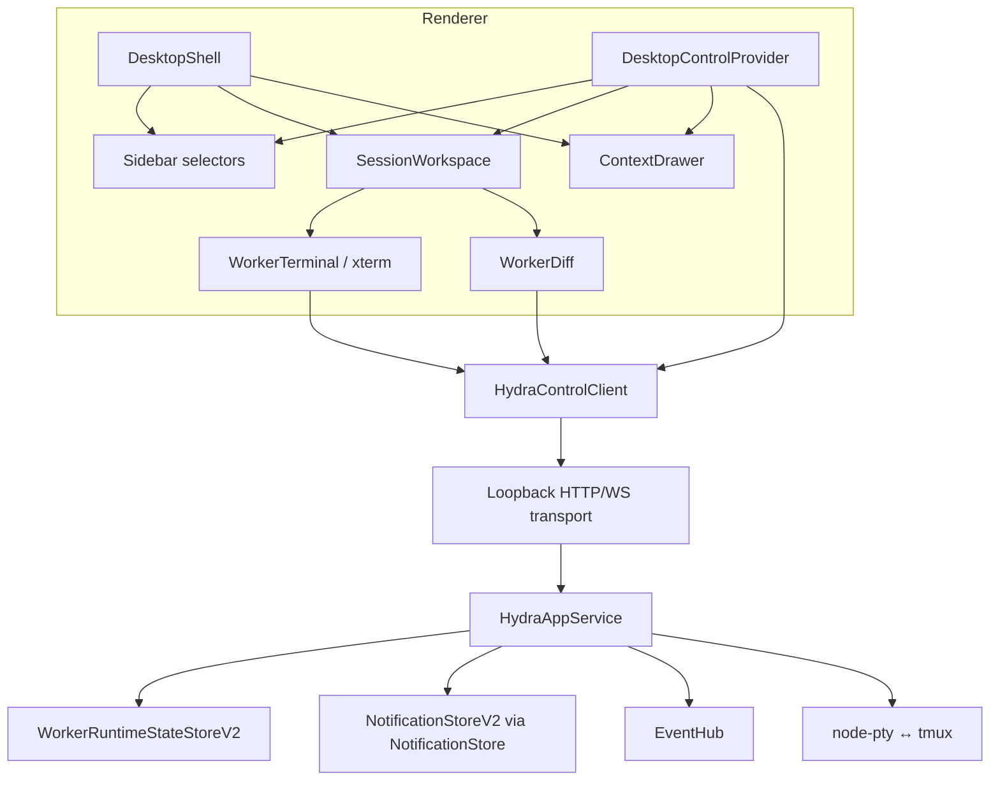

# Hydra Desktop v2 — Terminal-First Technical Design

**Status:** Implementation contract with production-density amendment<br>
**Decision date:** 2026-07-11<br>
**Density amendment:** 2026-07-12<br>
**Integration branch:** `feat/desktop-v2-terminal-first`<br>
**Base:** `origin/main` at `3dbb2c49390615797f1382e93ff7a4a1fdbb6bb0`

This document translates
[`PRODUCT-DESIGN.md`](./PRODUCT-DESIGN.md) into package boundaries, protocol
contracts, state ownership, migration steps, tests, and commit gates. Product
decisions remain owned by `PRODUCT-DESIGN.md`; this document owns how those
decisions are implemented.

The implementation is intentionally serial on one integration branch. Each
phase ends in a reviewable commit and passes its declared gates before the next
phase starts. The branch, rather than a runtime feature flag, is the isolation
boundary until the terminal-first frontend is complete.

## 1. Goals

1. Make Runtime v2 and Notification v2 first-class renderer contracts without
   breaking existing CLI and extension compatibility surfaces.
2. Replace the Mission Control/dashboard landing experience with a
   terminal-first Copilot workspace.
3. Preserve the existing xterm.js → WebSocket → node-pty → tmux seam.
4. Add the approved Copilot/Worker sidebar hierarchy.
5. Add a non-modal floating Context drawer with Copilot, Worker, and Attention
   modes.
6. Retain Worker Diff and lifecycle mutations behind `HydraControlClient`.
7. Keep every state transition keyed by durable Worker identity and v2
   occurrence identity rather than terminal text.
8. Support managed auxiliary shell panes through the additive contract in
   [`TMUX-SHELL-PANES.md`](./TMUX-SHELL-PANES.md), while preserving one
   session-level interactive terminal channel and a protected Agent pane.

## 2. Non-goals

- No normalized Conversation/transcript UI.
- No renderer access to Hydra JSON files or agent transcript files.
- No new daemon, database, or transport waist.
- No removal of v1 runtime/notification compatibility used by CLI or extension.
- No direct commit, push, or PR mutation.
- No multiple interactive terminal owners for one tmux session.
- No merge to `main` until all phases and packaged Desktop validation pass.

## 3. Current baseline and gaps

### 3.1 What already exists

- `HydraControlClient` over the three-method `HydraTransport` waist.
- `HydraAppService` in the sidecar with request, stream, and terminal handlers.
- `WorkerRuntimeStateStoreV2` and `WorkerRuntimeCoordinator`.
- `NotificationStoreV2` behind the passive `NotificationStore` compatibility
  facade.
- Full v2 runtime fields in `worker.runtime.changed` event payloads.
- Notification events carrying occurrence identity, lifecycle/run identity,
  status, and route data.
- `EventHub` with cursored replay and external-writer tailing.
- A legacy notification snapshot stream driven by `NotificationStateService`.
- A live Desktop board reducer, session tabs, xterm terminal, and Diff surface.
- The correct top-level Copilot/Worker split in the current Sidebar, though the
  header, landing screen, completion children, and visual hierarchy still match
  the previous product model.

### 3.2 Gaps to close

| Gap | Current behavior | Required behavior |
|---|---|---|
| Runtime initial snapshot | `sessions.list` exposes only v1 projection | Dedicated v2 runtime snapshot operation |
| Notification initial/live state | Desktop receives active legacy projection | Dedicated v2 occurrence list and snapshot topic |
| Renderer identity | Runtime overlays keyed mainly by session | Runtime and attention keyed by `workerId` |
| Landing surface | Permanent Overview/Mission Control tab | Last active Copilot Terminal or first-run empty state |
| Context | Permanent content in overview/cards | Floating overlay with three modes |
| Terminal lifecycle | Hidden terminals can retain active resources | Only visible terminal owns active channel resources |
| CSS | Large inline stylesheet in `index.html` | Renderer-owned token and component stylesheets |
| Icons | Mixed text glyphs | One tree-shakeable line-icon library |

## 4. Target architecture



## 5. Package ownership

| Package/area | Owns | Must not own |
|---|---|---|
| `@hydra/core` | Durable runtime/notification types, stores, transitions | Renderer view models |
| `@hydra/protocol` | Transport-safe DTOs, ops/topics, domain client methods | Store I/O or React state |
| `@hydra/sidecar` | Core composition, filtering, snapshots, stream fan-out | UI sorting or presentation strings |
| `@hydra/desktop` state | Snapshot/event reduction, indexes, selectors | File reads or direct core construction |
| `@hydra/desktop` UI | Layout, focus, interaction, visual states | Runtime inference from terminal bytes |
| Terminal bridge | One-owner PTY/tmux semantics and mirror mode | Notification or navigation policy |

## 6. Phase 1 protocol surface

Phase 1 is additive. Existing `sessions.list`, `notifications.list`, and
`notifications` topic remain unchanged so `docs/cli-contract.md` and existing
clients do not acquire Desktop-only fields.

### 6.1 New runtime snapshot DTO

`packages/protocol/src/dto.ts` type-imports and re-exports
`WorkerRuntimeSnapshotV2` from core.

```ts
export interface WorkerRuntimeListV2Result {
  version: 2;
  loadedAt: string;
  lastEventSeq: number;
  runtimes: WorkerRuntimeSnapshotV2[];
  count: number;
}
```

New operation and client method:

```ts
Op.listWorkerRuntimeV2 = 'workerRuntime.v2.list';

interface HydraControlClient {
  listWorkerRuntimeV2(): Promise<WorkerRuntimeListV2Result>;
}
```

`HydraAppService` records `eventLog.readLastSeq()` before reading the runtime
store. The client subscribes to `events` after that cursor. An event occurring
during the snapshot may be represented in both sources; reducer revision checks
make the duplicate harmless. Recording the cursor before the store read avoids
the inverse race where an event is skipped but absent from the snapshot.

Runtime remains live through the existing `events` topic. No second runtime
stream is introduced. `worker.runtime.changed` already contains the full v2
identity and revision fields.

### 6.2 New notification occurrence DTOs

`packages/protocol/src/dto.ts` type-imports and re-exports
`HydraNotificationV2` and `NotificationStatus` from core.

```ts
export interface NotificationOccurrenceFiltersV2 {
  workerId?: number;
  session?: string;
  sourceSession?: string;
  targetSession?: string;
  kind?: NotificationKind;
  status?: NotificationStatus;
  limit?: number;
}

export interface NotificationOccurrenceListV2Result {
  version: 2;
  occurrences: HydraNotificationV2[];
  count: number;
  totalCount: number;
  activeCount: number;
  unreadCount: number;
}

export interface NotificationOccurrenceSnapshotV2
  extends NotificationOccurrenceListV2Result {
  loadedAt: string;
  lastEventSeq: number;
}
```

Filtering rules:

- `session` matches source or target route;
- all other identity filters are exact;
- `limit` applies after newest-first ordering;
- `totalCount`, `activeCount`, and `unreadCount` describe the un-limited data
  after identity/status/kind filtering;
- invalid worker IDs, limits, kinds, statuses, and oversized session values fail
  closed at the sidecar boundary.

New operation, topic, and client methods:

```ts
Op.listNotificationOccurrencesV2 = 'notifications.v2.list';
Topic.notificationOccurrencesV2 = 'notifications-v2';

interface HydraControlClient {
  listNotificationOccurrencesV2(
    filters?: NotificationOccurrenceFiltersV2,
  ): Promise<NotificationOccurrenceListV2Result>;

  subscribeNotificationOccurrencesV2(
    filters?: NotificationOccurrenceFiltersV2,
  ): AsyncIterable<NotificationOccurrenceSnapshotV2>;
}
```

The existing read, dismiss, and clear operations keep their current request
shapes because v1 records and v2 occurrences share notification IDs. Lifecycle
transitions remain the normal resolver for needs-input and completion.

### 6.3 Sidecar composition

`HydraAppServiceOptions` gains an injectable `runtimeV2Store`. The service uses
that exact instance for list operations and passes it into
`WorkerLifecycleService`. `NotificationStore` remains the only notification
facade used by the sidecar; its existing `listOccurrences()` method exposes the
v2 records without duplicating store ownership.

The sidecar adds filtered occurrence subscribers alongside legacy notification
subscribers. Both reuse one `NotificationStateService` watcher:

- first subscriber starts the watcher;
- every subscriber immediately receives an authoritative snapshot;
- a notification change rebuilds a v2 snapshot from
  `NotificationStore.listOccurrences()`;
- the watcher stops only when both legacy and v2 subscriber sets are empty;
- cancellation closes only that subscriber;
- `dispose()` closes both sets.

The v2 stream sends snapshots, not incremental bodies in `events.jsonl`.
Notification bodies are sensitive and the EventLog sanitizer intentionally
redacts text-like payload keys.

### 6.4 Protocol compatibility

- `protocolCompatibilitySmoke` must see every new op/topic in both client and
  sidecar dispatchers.
- `protocolContractSmoke` continues validating the unchanged CLI-shaped DTOs.
- A new focused smoke validates v2 runtime snapshot cursor behavior, occurrence
  filters, initial stream snapshot, live create/read/dismiss transitions, and
  iterator cancellation.
- Loopback smoke proves both new request ops and the new WebSocket topic.

## 7. Phase 2 renderer control state

The current `missionControl/boardModel.ts` mixes legacy notification projection,
session grouping, dashboard stats, and renderer view models. It is replaced in
stages by a neutral control-state module:

```text
packages/desktop/src/renderer/controlState/
├── model.ts
├── reducer.ts
├── selectors.ts
├── eventAdapters.ts
└── useDesktopControlState.ts
```

### 7.1 Authoritative model

```ts
interface DesktopControlModel {
  sessions: HydraSessionList;
  runtimeByWorkerId: ReadonlyMap<number, WorkerRuntimeSnapshotV2>;
  occurrencesById: ReadonlyMap<string, HydraNotificationV2>;
  gitStatusBySession: Readonly<Record<string, GitChangeStatus>>;
  lastEventSeq: number;
  sessionsConnected: boolean;
  attentionConnected: boolean;
}
```

The reducer owns immutable domain state only. It does not store drawer state,
expanded groups, selected tabs, CSS state, or presentation strings.

### 7.2 Boot sequence

1. Load sessions and runtime v2 snapshot in parallel.
2. Subscribe to events after the runtime snapshot cursor.
3. Subscribe to active notification occurrence snapshots.
4. Start best-effort batched Git-status polling.
5. Apply buffered event deltas by sequence and runtime revision.
6. Refetch session membership after create/delete/restore events.

Notification snapshots replace the occurrence map authoritatively for their
filter scope. Runtime events apply only when:

- `workerId` is a positive safe integer;
- the event carries all required v2 identity fields;
- `lifecycleEpoch` matches current session identity;
- revision is newer than the stored snapshot;
- the event is not a stale run/epoch replay.

Malformed events are logged and ignored, then trigger a bounded runtime
snapshot refresh rather than a renderer crash.

### 7.3 Selectors

Pure selectors produce:

- flat Copilot rows and aggregate managed-Worker/repository counts;
- Worker groups by repository and Local Tasks;
- Copilot Context rows sorted by attention priority;
- Worker Context data;
- global Attention rows;
- selected session header state;
- per-session unread and active-attention counts.

Selectors join on stable `workerId`. Session names remain terminal/diff route
addresses and display aliases.

### 7.4 Migration strategy

The current `SessionsProvider` remains the mutation owner initially. Its board
dependency is replaced by `DesktopControlProvider`, then consumers migrate one
surface at a time. Legacy board modules are deleted only after Sidebar,
Context, Attention, session header, and completion routing all use the new
selectors.

No permanent v1/v2 shadow reducer is shipped. Focused smokes compare old and new
selectors during migration, then the old model is removed.

## 8. Phase 3 shell, navigation, and terminal-first workspace

### 8.1 Component target

```text
renderer/
├── shell/
│   ├── DesktopShell.tsx
│   ├── SessionHeader.tsx
│   ├── FirstRun.tsx
│   └── shellState.ts
├── sidebar/
│   ├── Sidebar.tsx
│   ├── SidebarHeader.tsx
│   ├── CopilotSection.tsx
│   ├── WorkerSection.tsx
│   └── SessionRow.tsx
├── workspace/
│   ├── SessionWorkspace.tsx
│   └── SessionTabs.tsx
└── context/
    ├── ContextDrawer.tsx
    ├── CopilotContext.tsx
    ├── WorkerContext.tsx
    └── AttentionContext.tsx
```

The final file split may remain smaller when a component has no independent
state or test value; ownership boundaries above must remain.

### 8.2 Landing and tabs

- Remove the permanent Overview tab.
- Persist the last selected session locally.
- On launch choose, in order: last live Copilot, first live Copilot, first live
  session, first-run empty state.
- Opening the same session focuses its existing tab.
- A single session uses one consolidated header; a compact tab strip appears
  only when multiple sessions are open.
- Closing a tab never stops the session.
- Rename/restore updates route aliases without losing stable Worker state.

### 8.3 Copilot and Worker workspaces

- Copilot: Terminal only.
- Code Worker: `Terminal | Diff`, with Terminal default.
- Local Task: Terminal only.
- Completion action on a code Worker may open Diff directly.
- Needs-input and error open Terminal and Context for that Worker.

### 8.4 Terminal lifecycle hardening

The terminal bridge wire contract does not change. Renderer work is limited to
surface ownership and resource lifecycle:

- xterm instance and scrollback survive tab switches;
- only the visible terminal retains an interactive channel;
- hidden panes close WebSocket/PTy resources and any optional renderer
  accelerator;
- reactivation waits one animation frame, fits once, and reconnects;
- resize events are animation-frame coalesced and dimension-deduplicated;
- reconnect, clear-local-buffer, and maximize actions match the product spec;
- one-owner replacement errors are surfaced with a direct reconnect action.

The implementation must reconcile or cherry-pick any independently landed
terminal-lifecycle work before editing the same files. Do not copy uncommitted
changes from another worktree.

## 9. Phase 4 floating Context and Attention

### 9.1 UI state

Context UI state belongs to a renderer provider and persists only presentation
preferences:

```ts
type ContextMode = 'copilot' | 'worker' | 'attention';

interface ContextUiState {
  open: boolean;
  mode: ContextMode;
  subjectSession: string | null;
}
```

It does not copy domain data. Context components read the latest selectors for
their subject.

### 9.2 Overlay mechanics

- Render the drawer in the main workspace stacking context, not as a grid
  column.
- Use fixed workspace insets and `position: absolute`.
- Use a 320 px drawer at default width and 304 px below 1200 px.
- Offset the drawer to y = 114 px when the 42 px multi-session TabBar exists;
  a one-tab session uses y = 72 px. This keeps Context below SessionHeader in
  both layouts.
- Use intrinsic height with a viewport-clamped `max-height`; the body becomes
  the scroll owner only when content reaches that cap.
- Do not change the terminal container's client width when opening/closing.
- Drawer scroll is independent from terminal scrollback.
- No click-away close from terminal interaction.
- `Escape` closes the focused drawer after menus/modals.
- Opening Context does not steal terminal focus until a drawer control is used.

### 9.3 Context modes

- Copilot mode reads aggregate selectors and offers Broadcast/Create Worker.
- Worker mode reads runtime v2, session source data, Diff data, parent route,
  and active occurrences.
- Attention mode lists active v2 occurrences and offers state-specific routing.
- History queries resolved/superseded/dismissed records through the v2 list
  operation rather than keeping all terminal history in renderer memory.

### 9.4 Attention semantics

- Error before needs-input before unread complete.
- Dedupe by `occurrenceId`.
- Read changes only `readAt`.
- Dismiss changes occurrence status only.
- Replying to needs-input uses the existing Worker lifecycle send path, which
  resolves the occurrence and resumes the same run.
- Opening complete routes to Diff and acknowledges only complete for that
  Worker; it never clears needs-input or error.

## 10. Phase 5 supporting flows and visual system

### 10.1 Creation

- New Copilot is the Sidebar primary action.
- Adjacent menu creates Code Worker or Local Task.
- Existing create DTOs remain sufficient for v2 UI.
- Parent Copilot is preset from current selection but editable.
- Modal validation remains inline; no mutation occurs until submit.

### 10.2 Styles

Move renderer styles out of the large `index.html` block into imported files:

```text
renderer/styles/
├── tokens.css
├── base.css
├── shell.css
├── sidebar.css
├── workspace.css
├── context.css
├── diff.css
└── states.css
```

`index.html` retains CSP, root markup, and bundle links only. Existing `--hy-*`
tokens are migrated before component styles so light/dark behavior remains
stable throughout the refactor.

Use `lucide-react` as the single line-icon system unless dependency review
identifies a repository-standard alternative before Phase 5 starts. Tree
shaking must keep the renderer bundle impact bounded.

### 10.3 Production density regression contract

- `AppLayout.tsx` owns a 296 px default Sidebar clamped to 228–320 px. The
  localStorage key is `hydra.sidebarWidth.v3`; changing the key is intentional
  so installs do not retain the superseded 310–340 px concept-mock width.
- `Tree.tsx` owns section and Local Tasks collapse state. Search forces matching
  groups open without changing their saved local disclosure state.
- `sidebar/disclosure.ts` is the pure slice policy: five Copilots and four Local
  Tasks by default, all matches during filtering, and a toggle only on overflow.
- Sidebar, Context, and footer geometry live in their component stylesheets;
  sampled surface colors stay in `tokens.css`.
- Runtime `unknown` remains the domain value. Context presentation uses an em
  dash only visually and keeps `Unknown` in `title` and `aria-label`.
- `supportingFlowsSmoke.mjs` must cover collapsed, expanded, and filtered row
  disclosure. Real packaged-app QA must cover the clickable Local Tasks caret
  and Show more / Show less controls.

### 10.4 Supporting states

Implement and smoke-test first run, no Workers, stopped session, no Diff,
sidecar reconnecting, terminal exited/replaced, notification failure, and
Git-status failure exactly as specified in `PRODUCT-DESIGN.md`.

## 11. Files expected to change

### Phase 1

- `packages/protocol/src/dto.ts`
- `packages/protocol/src/ops.ts`
- `packages/protocol/src/client.ts`
- `packages/sidecar/src/appService.ts`
- `packages/sidecar/src/smoke/protocolCompatibilitySmoke.ts`
- `packages/sidecar/src/smoke/seamSmoke.ts`
- `packages/sidecar/src/smoke/loopbackSmoke.ts`
- new focused v2 protocol smoke if seam coverage becomes too broad

### Phase 2

- new `packages/desktop/src/renderer/controlState/*`
- `packages/desktop/src/renderer/sessions/SessionsProvider.tsx`
- current board model/hook and mission-control smoke during migration
- root `package.json` smoke wiring

### Phase 3

- `App.tsx`, `AppLayout.tsx`
- `sidebar/*`
- `tabs/*` or their `shell/workspace` replacements
- `routes/WorkerTerminal.tsx`
- terminal-focused desktop smoke

### Phase 4

- new `context/*`
- notification routing helpers
- session/attention selectors and smokes

### Phase 5

- creation dialogs and session actions
- `index.html` and new style files
- `packages/desktop/package.json` and lockfile if icon dependency is approved
- packaged-app smoke/manual evidence

This is an ownership forecast, not permission to edit unrelated files. Every
phase must keep its diff within the narrowest useful boundary.

## 12. Validation contract

### Every commit

```bash
npm run compile
npm run lint
git diff --check
```

### Phase 1

```bash
npm run smoke:protocol-contract
npm run smoke:protocol-compatibility
npm run smoke:seam
npm run smoke:loopback
npm run smoke:notification-v2
env -u HYDRA_CONFIG_PATH -u HYDRA_HOME npm test
```

### Phase 2

```bash
npm run smoke:mission-control
npm run smoke:event-hub
npm run smoke:notification-state
npm run smoke:notification-v2
env -u HYDRA_CONFIG_PATH -u HYDRA_HOME npm test
```

The existing `smoke:mission-control` may be renamed only when its replacement
tests the same snapshot/event race, grouping, status, and attention behavior.

### Phase 3

```bash
npm run smoke:terminal
npm run smoke:desktop-diff
npm run smoke:desktop-external-links
env -u HYDRA_CONFIG_PATH -u HYDRA_HOME npm test
```

### Phases 4–5

Run all focused protocol, state, terminal, Diff, notification, and Desktop
smokes plus the clean full suite. Final validation also requires a freshly
packaged macOS app and real interactive checks for:

1. Copilot Terminal first launch;
2. Sidebar Copilot/Worker hierarchy;
3. Context open/close without terminal geometry change;
4. needs-input → Worker Terminal route and reply/resume;
5. complete → Worker Diff and complete-only acknowledgement;
6. error routing;
7. hidden terminal resource release and reconnect;
8. stopped/deleted/renamed/restored session behavior;
9. light and dark appearance at 980 × 640 and 1440-class sizes.

Pixel-fidelity validation is a blocking Phase 5 gate. Capture the packaged app
at the default 1280 × 800 viewport with a selected Copilot and Context open,
plus the 980 × 640 dark minimum viewport. Compare the same-state implementation
against the composition anchor and focused production references in
`docs/desktop-v2/assets/` on one canvas, then repeat after every P0/P1/P2 fix.
Store the final full-view and focused-region evidence under
`docs/desktop-v2/qa/`; `design-qa.md` must end with exactly
`final result: passed` before packaging or handoff is considered complete.

## 13. Commit and review sequence

Use one integration branch and serial commits:

1. `docs(desktop): define terminal-first v2 implementation contract`
2. `feat(protocol): expose desktop runtime and notification v2 state`
3. `refactor(desktop): introduce v2 control state`
4. `feat(desktop): make copilot terminal the primary workspace`
5. `feat(desktop): add floating context and attention surfaces`
6. `feat(desktop): complete terminal-first supporting flows`
7. focused validation fixes, only when evidence requires them

Do not create a large stack of promotion PRs. Keep the integration branch
reviewable through phase commits, then choose the final `main` promotion shape
from the completed diff and CI evidence.

## 14. Risks and mitigations

| Risk | Mitigation |
|---|---|
| V1/v2 state divergence | Keep v1 compatibility passive; UI reads v2 directly; retain migration smokes |
| Snapshot/event race | Cursor before store read; revision/occurrence idempotency |
| Sensitive notification text in events | Stream authoritative snapshots; do not rely on EventLog bodies |
| Multiple store instances in sidecar | Inject one runtime v2 store; use NotificationStore facade for occurrences |
| Renderer state tied to renamed session | Join runtime/attention by workerId and treat session as route alias |
| Terminal resize churn | Context overlay never reflows; coalesce genuine window/sidebar resize |
| Hidden terminal resource growth | Keep xterm state but release active channel resources |
| Existing worktree edits overlap terminal files | Reconcile only committed upstream work at the Phase 3 boundary |
| Giant frontend rewrite obscures regressions | Pure state model first, then migrate one surface per phase |
| CSS drift during migration | Move tokens first; compare every milestone to approved visual anchor |
| New icon dependency bloats app | Tree-shake named icons and inspect renderer bundle size |

## 15. Rollback strategy

- Before merge, rollback is deleting or resetting the integration branch; no
  runtime flag or user state migration is required.
- Protocol additions are backward compatible and may remain even if UI rollout
  pauses.
- V1 stores and existing CLI/extension operations remain available throughout.
- Renderer local preferences use new versioned keys so old values can be
  ignored without destructive migration.
- If final UI validation fails, keep `main` on the current Desktop and continue
  fixes on the integration branch rather than partially promoting surfaces.

## 16. Definition of done

Implementation is complete only when:

- every acceptance criterion in `PRODUCT-DESIGN.md` passes;
- renderer runtime and attention state comes from direct v2 contracts;
- no renderer terminal-text inference or direct file read exists;
- current CLI and extension compatibility tests still pass;
- all focused and clean full-suite gates pass;
- the fresh packaged app matches the approved visual anchor and interaction
  model;
- `design-qa.md` contains combined full-view and focused comparisons, viewport
  and interaction evidence, a zero-error console check, and
  `final result: passed`;
- the integration branch is clean, documented, and ready for one deliberate
  promotion decision.
