# Hydra Desktop v2 — Managed tmux Shell Panes

**Status:** Implemented; self-reviewed<br>
**Decision date:** 2026-07-20<br>
**Applies to:** `packages/core`, `packages/protocol`, `packages/sidecar`, and
`packages/desktop`<br>
**Product source:** Combined direct-create and advanced-control direction
approved in the Desktop v2 Terminal-first workspace

This document defines how Hydra Desktop creates, focuses, and closes auxiliary
tmux shell panes without losing the stable identity of the Agent pane. It is an
additive feature amendment to [`PRODUCT-DESIGN.md`](./PRODUCT-DESIGN.md) and
[`TECHNICAL-DESIGN.md`](./TECHNICAL-DESIGN.md).

## 1. Decision summary

Hydra keeps one tmux session and one interactive terminal channel per running
Copilot or Worker. tmux continues to own the window grid and draws every split
into the existing xterm surface.

The Terminal utility row adds a split `New Shell` control:

- clicking the primary action immediately creates a downward split;
- clicking its disclosure opens advanced creation settings and the current
  managed-pane list;
- advanced creation chooses split direction, start directory, and an optional
  command;
- the pane list can focus the Agent or any managed shell pane;
- Hydra-created shell panes can be closed after an explicit warning;
- the Agent pane cannot be closed through this surface.

This is managed tmux control, not a renderer-native multi-terminal layout. No
per-pane WebSocket, xterm instance, or React grid is introduced.

## 2. Product contract

### 2.1 Direct create

The main `New Shell` action uses these defaults:

| Field | Default |
|---|---|
| Direction | `down` |
| Size | 35% of the split target |
| Start directory | Session workdir |
| Command | None; open the user's normal shell |
| Focus | New pane |

The button is disabled when the Terminal is inactive, the session is stopped,
a pane mutation is running, or the managed Agent window already contains four
panes total.

### 2.2 Advanced disclosure

Opening the disclosure fetches a fresh pane snapshot and shows two sections:

1. **Open panes**
   - Agent: focus only, visibly protected;
   - Shell N: focus and close;
   - external/unmanaged pane: visible when it shares the Agent window, focus
     only, never close.
2. **New shell**
   - `Split down` or `Split right`;
   - `Session workdir` or `Agent current directory`;
   - optional single-line `Run command`;
   - `Create pane`.

The snapshot refreshes after every mutation and once per second only while the
disclosure is open. This lets a shell that exits naturally disappear from the
list without adding a global pane event stream.

### 2.3 Close behavior

Closing a shell pane always asks:

> Close Shell N? Running processes in this pane will stop.

On confirmation Hydra closes exactly the selected pane ID. If it was active,
Hydra focuses the Agent pane after the close. A shell may also close itself by
running `exit`; the next disclosure refresh removes it.

Close is idempotent for a pane that disappeared after the user opened the
confirmation. A pane ID that now belongs to another session is an ownership
error, not an idempotent success.

### 2.4 Scope limits

- At most four panes total in the Agent window. External panes count toward the
  limit, so Hydra creates at most three shell panes and may create fewer.
- Hydra manages only the window containing the Agent pane. Other tmux windows
  remain accessible through native tmux controls but are outside this UI.
- The first release does not provide drag-to-resize, saved layouts, shell
  history, command presets, or renderer-native pane surfaces.
- Desktop v2 remains macOS/Linux scoped. psmux compatibility may be tested but
  is not a release gate for this feature.

## 3. Current baseline and correctness gap

The repository already has the low-level pieces:

- `TmuxBackendCore.splitPane()` performs a downward `split-window`;
- `TerminalBridge` attaches one node-pty client to the whole session, so tmux
  already renders a multi-pane grid into the existing WebSocket/xterm channel;
- `WorkerTerminal` already has a utility action row suitable for `New Shell`;
- loopback terminal authorization already calls
  `SessionManager.assertHydraSessionOwnership()`.

The existing low-level split must not be exposed directly. `sendKeys()`,
`capturePane()`, and `sendMessage()` target only the session name. In tmux that
means the current pane. Once a shell pane becomes active, Agent launch, restore,
readiness probes, logs, and message delivery can hit the shell instead of the
Agent.

There is a second lifecycle gap: today a live tmux session implies a running
Hydra session. With auxiliary panes, the Agent pane may disappear while a shell
keeps the tmux session alive. Session reconciliation must distinguish those
states.

Agent-pane identity and liveness therefore land before the Desktop create
button.

## 4. Target architecture

```mermaid
flowchart LR
  UI["WorkerTerminal / NewShellControl"]
  Client["HydraControlClient"]
  RPC["Loopback request"]
  App["HydraAppService"]
  Manager["SessionTerminalService"]
  Backend["Tmux pane capability"]
  Session["Existing Hydra tmux session"]
  Bridge["Existing node-pty attach"]
  Xterm["Existing xterm surface"]

  UI --> Client --> RPC --> App --> Manager --> Backend --> Session
  Session --> Bridge --> Xterm
```



Pane mutations use normal authenticated request/response operations. The
existing high-privilege terminal WebSocket stays session-scoped and unchanged.
tmux redraws attached clients after split, focus, and close.

## 5. tmux identity model

### 5.1 Metadata

Every newly created Hydra session records its initial pane ID immediately after
`new-session` and before any Agent launch command is sent:

```text
session option  @hydra-agent-pane     %12
pane option     @hydra-pane-role      agent
pane title      Agent · Codex
```

Every Hydra-created auxiliary pane records:

```text
pane option     @hydra-pane-role      shell
pane option     @hydra-pane-label     Shell 1
pane option     @hydra-pane-request-id <UUID>
pane title      Shell 1 · repo root
```

tmux pane IDs are the durable routing key. Pane index is display-only because
indices change when neighboring panes close.

### 5.2 Agent target resolution

All backend methods that automate the Agent resolve an explicit pane target:

1. read `@hydra-agent-pane`;
2. confirm that pane ID still belongs to the expected session;
3. target that pane for send, paste, capture, launch, restore, readiness, and
   status operations.

`getSessionPanePids()` intentionally continues to return every pane PID for
whole-session resource reporting.

### 5.3 Legacy migration

Migration is lazy and fail-closed:

- missing metadata plus exactly one pane: mark it as the Agent pane;
- valid metadata: use it;
- missing metadata plus multiple panes: do not guess from process name, pane
  index, title, or activity; reject Agent automation and managed-pane mutation
  with a restart-required error;
- metadata pointing to a pane in another session: treat as ownership corruption
  and reject.

Agent process-name inference was considered and rejected: several supported
agents run through shell or Node launchers, so it cannot uniquely identify the
correct pane.

### 5.4 Agent pane loss

`TmuxBackendCore.listSessions()` adds one batched `list-panes -a` snapshot and
projects optional `agentPaneId` and `agentPaneAlive` fields onto each live
session. This avoids one tmux process per session.

When a known `@hydra-agent-pane` no longer exists:

1. `SessionManager.sync()` excludes the tmux session from the valid-live map;
2. it excludes the same route from live-session discovery;
3. it marks the Hydra session stopped;
4. after state reconciliation, it best-effort kills the invalid tmux session so
   auxiliary processes do not survive as a misleading running Worker;
5. failure to kill is logged and surfaced through normal diagnostics, but the
   session remains stopped in Hydra state.

A missing metadata option is not the same as a dead Agent pane. Legacy sessions
remain running; only managed pane actions are blocked when migration is
ambiguous.

## 6. Core contracts

Pane control is an optional backend capability instead of adding four required
methods directly to `MultiplexerBackendCore`. This keeps unrelated test doubles
and any future non-tmux multiplexer implementation source-compatible.

```ts
export type TerminalPaneRole = 'agent' | 'shell' | 'external';
export type TerminalPaneDirection = 'down' | 'right';
export type TerminalPaneStartDirectory =
  | 'session-workdir'
  | 'agent-current-directory';

export interface TerminalPaneSnapshot {
  paneId: string;
  windowId: string;
  paneIndex: number;
  title: string;
  label: string;
  role: TerminalPaneRole;
  active: boolean;
  currentCommand: string | null;
  currentPath: string | null;
  canClose: boolean;
}

export interface CreateTerminalPaneOptions {
  requestId: string;
  direction: TerminalPaneDirection;
  cwd: string;
  targetPaneId: string;
  command?: string;
}

export interface TerminalPaneController {
  list(sessionName: string): Promise<TerminalPaneSnapshot[]>;
  create(
    sessionName: string,
    options: CreateTerminalPaneOptions,
  ): Promise<TerminalPaneSnapshot[]>;
  focus(sessionName: string, paneId: string): Promise<TerminalPaneSnapshot[]>;
  close(sessionName: string, paneId: string): Promise<{
    outcome: 'closed' | 'already-closed';
    panes: TerminalPaneSnapshot[];
  }>;
}

export interface MultiplexerBackendCore {
  // Existing members omitted.
  readonly terminalPanes?: TerminalPaneController;
}
```

`TmuxBackendCore` supplies the capability. Test backends opt in only when their
test exercises pane behavior. Production pane operations reject with
`Terminal pane control is unavailable for this multiplexer` when the capability
is absent.

### 6.1 SessionTerminalService

`SessionTerminalService` is the domain boundary used by the sidecar. It owns:

- Hydra ownership and live-session checks;
- Agent-pane migration and validation;
- session workdir / Agent current-directory resolution;
- per-session mutation serialization;
- maximum-pane enforcement;
- create rollback;
- close protection;
- result normalization.

The sidecar does not assemble tmux commands directly.

### 6.2 Create algorithm

1. Assert Hydra session ownership and require `live === true`.
2. Resolve and validate the Agent pane.
3. Look for an existing shell with the same request ID. Return it instead of
   creating another pane; this check runs before the pane-cap check.
4. List panes in the Agent window and enforce the four-pane limit.
5. Resolve the split target:
   - current active pane when it belongs to the Agent window;
   - otherwise the Agent pane.
6. Resolve cwd from server-owned state:
   - `session-workdir` uses persisted Hydra workdir;
   - `agent-current-directory` queries `#{pane_current_path}` from the Agent
     pane.
7. Create the pane:

   ```text
   down  → split-window -v -p 35 -P -F <format>
   right → split-window -h -p 40 -P -F <format>
   ```

8. Set role, label, request ID, and title on the returned pane ID.
9. Enable a session-local pane border title while the Agent window contains
   more than one pane.
10. When `command` is present, load it through a temporary tmux buffer, paste it
   into the new pane, then send Enter. Do not interpolate it into the
   `split-window` shell command.
11. Return a fresh pane snapshot.

The operation has an explicit commit point. Before command Enter is submitted,
any metadata or paste failure best-effort closes the newly created pane and
returns the original error. After Enter is submitted, Hydra never kills the
pane merely because the final list refresh or response serialization failed;
it reports partial success and requires a fresh list. This prevents both
half-managed shells and accidental termination of a command that already
started producing side effects. Retrying with the same request ID returns the
existing pane rather than creating a duplicate.

### 6.3 Focus algorithm

1. Reassert session ownership.
2. Confirm the pane belongs to the Agent window.
3. Select its window, then `select-pane -t <paneId>`.
4. Return a fresh pane snapshot.

Focus is allowed for Agent, Hydra shell, and external panes in the Agent window.

### 6.4 Close algorithm

1. Reassert session ownership.
2. Read `@hydra-agent-pane` and reject immediately when the requested pane ID
   matches it, even if that pane has already disappeared.
3. Resolve the requested pane globally enough to distinguish already-gone from
   moved-to-another-session.
4. If it belongs to another session, reject.
5. If it no longer exists, return `already-closed` and a fresh snapshot.
6. Require `@hydra-pane-role=shell`; external panes are never closeable.
7. `kill-pane -t <paneId>`.
8. If the closed pane was active, select the Agent pane.
9. Disable pane-border titles only when the Agent is the sole remaining pane in
   its window.
10. Return `closed` and a fresh snapshot.

The backend repeats every guard immediately before `kill-pane`; renderer state
is advisory only.

## 7. Protocol contract

Add these request operations to `@hydra/protocol`:

```ts
listTerminalPanes:  'terminal.panes.list'
createTerminalPane: 'terminal.pane.create'
focusTerminalPane:  'terminal.pane.focus'
closeTerminalPane:  'terminal.pane.close'
```

DTOs:

```ts
export interface TerminalPaneListInput {
  session: string;
}

export interface TerminalPaneCreateInput {
  session: string;
  requestId: string;
  direction: 'down' | 'right';
  startDirectory: 'session-workdir' | 'agent-current-directory';
  command?: string;
}

export interface TerminalPaneTargetInput {
  session: string;
  paneId: string;
}

export interface TerminalPaneListResult {
  session: string;
  agentPaneId: string;
  panes: TerminalPaneSnapshot[];
  maxPanes: number;
}

export interface TerminalPaneCloseResult extends TerminalPaneListResult {
  outcome: 'closed' | 'already-closed';
}
```

`HydraControlClient` exposes matching list/create/focus/close methods. These are
app-internal control operations, like `gitStatus.get`; CLI parity is not required
for the first Desktop release.

No pane operation is added to `TerminalAttachInput` or `TerminalChannel`.

## 8. Validation and security

Every request must:

- authenticate through the existing loopback bearer/origin gate;
- call `assertHydraSessionOwnership(session)`;
- require a live, metadata-matching Hydra session;
- confirm each pane ID belongs to the expected session and Agent window;
- treat session, pane, cwd, format, and direction as structured arguments;
- never accept an arbitrary cwd from the renderer;
- never log, persist, emit, or include the optional command in telemetry or
  error context;
- cap command length at 4096 UTF-16 code units;
- reject NUL, carriage return, and newline in the optional command;
- require a valid UUID request ID for idempotent create;
- serialize create/focus/close mutations per session;
- return bounded pane lists from server truth after every mutation.

The optional command intentionally has local shell authority equivalent to
typing in the already-authorized interactive terminal. It is transferred via a
0600 temporary file and tmux buffer and is deleted in `finally`.

New pane-control commands should use an argv-based tmux runner built from the
multiplexer binary plus `getTmuxSocketArgs()`. The existing shell-string `exec`
path remains for compatibility-sensitive Agent launch operations; user command
content never enters that path.

## 9. Renderer implementation

Add a terminal-local control rather than expanding global session state:

```text
packages/desktop/src/renderer/routes/terminal/NewShellControl.tsx
packages/desktop/src/renderer/routes/terminal/NewShellPopover.tsx
packages/desktop/src/renderer/routes/terminal/ClosePaneConfirm.tsx
```

`WorkerTerminal` supplies `session` and `active`, and owns:

- disclosure open/close state;
- the ephemeral pane snapshot;
- one initial snapshot fetch whenever the Terminal becomes active;
- one-second refresh while open;
- create/focus/close busy state;
- local error presentation;
- returning focus to xterm after a successful mutation.

Each create intent receives one `crypto.randomUUID()` value. The renderer keeps
that value through an explicit retry and allocates a new one only after success,
cancellation, or a deliberate new create action.

The primary button calls create with defaults without first opening the
popover. The server is authoritative for pane count and ownership, so a stale
renderer cannot bypass the cap or close protection.

Closing uses the existing modal visual language, not `window.confirm`. Closing
the disclosure, switching tabs, or hiding the Terminal cancels refresh timers
but never closes a tmux pane.

## 10. Terminal bridge behavior

The interactive path requires no protocol or bridge change. `tmux attach`
renders native borders, forwards mouse/key navigation, and repaints after an
out-of-band pane mutation.

The current read-only mirror captures the active pane, not a composited
multi-pane window. This limitation is accepted for the first release because
Desktop keeps one visible interactive owner and inactive tabs release their
channel. A future true multi-pane mirror requires per-pane capture/composition
and is explicitly outside this feature.

## 11. Failure and concurrency semantics

| Condition | Required behavior |
|---|---|
| Double-click create | One per-session mutation at a time; UI disabled |
| Pane cap reached | No mutation; actionable error |
| Session stopped during request | No mutation or best-effort rollback |
| Split succeeds, metadata fails before commit | Close new pane; return original error |
| Command paste fails before Enter | Close new pane; do not leave a half-created pane |
| Post-commit snapshot/response fails | Preserve pane; retry with the same request ID returns it |
| Shell exits while close confirm is open | `already-closed`; no error toast |
| Pane ID belongs to another session | Ownership error |
| Attempt to close Agent pane | Hard rejection |
| Attempt to close external pane | Hard rejection |
| Agent pane disappears | Mark stopped and best-effort kill remaining session |
| Newer interactive viewer attaches | Existing newest-owner semantics remain |

Pane state is authoritative in tmux. The per-session sidecar mutex prevents
local UI races; every mutation revalidates tmux state so CLI or native tmux
changes cannot bypass guards.

## 12. Implementation sequence

### PR 1 — Agent pane identity and routing

- record initial Agent pane metadata in every session creation/recreation path;
- add legacy single-pane backfill;
- route send, capture, launch, restore, and readiness to the Agent pane;
- project Agent-pane liveness in batched session listing;
- reconcile and clean sessions whose known Agent pane vanished;
- add core and real-tmux smoke coverage.

Gate: no Desktop control is exposed until this PR lands.

### PR 2 — Pane domain and protocol

- add the optional backend pane capability;
- add `SessionTerminalService` and per-session mutation serialization;
- implement list/create/focus/close with rollback and close protection;
- add protocol DTOs, client methods, and `HydraAppService` dispatch;
- add ownership, compatibility, seam, loopback, and isolated real-tmux tests.

### PR 3 — Combined Desktop interaction

- add the direct create split button;
- add advanced creation and open-pane disclosure;
- add focus and confirmed close;
- add loading, disabled, empty, cap, stale, and failure states;
- add renderer interaction smoke coverage and packaged-app QA.

## 13. Test contract

### Core and real tmux

- initial pane receives Agent metadata before first `sendKeys`;
- legacy single-pane session backfills safely;
- legacy ambiguous multi-pane session fails closed;
- shell active does not change Agent send/capture target;
- down/right splits return the correct stable pane ID;
- session workdir and Agent current directory resolve correctly;
- optional command executes in the new shell and the pane stays open afterward;
- metadata or paste failure rolls the pane back;
- list classifies Agent, Hydra shell, and external panes;
- focus selects the exact pane;
- close kills only the requested Hydra shell;
- close Agent and close external are rejected;
- natural shell exit becomes `already-closed` under a stale close request;
- Agent pane loss does not leave the Worker running because of auxiliary panes;
- session rename preserves Agent pane routing;
- isolated-socket cleanup leaves no tmux server behind.

### Protocol and sidecar

- all four operations round-trip through `HydraControlClient`;
- unknown, stopped, foreign, role-mismatched, and worker-ID-mismatched sessions
  are rejected;
- pane IDs from another session are rejected;
- invalid direction, directory mode, command length, and control characters are
  rejected;
- unsupported backend capability returns a stable error;
- command content is absent from logs and event output;
- create/focus/close return fresh bounded snapshots.

### Desktop

- primary click creates exactly one default shell;
- disclosure loads and refreshes pane state only while open;
- advanced fields submit exact enum values;
- Agent row has no close action;
- external row has no close action;
- Shell close always presents the running-process warning;
- confirmation cancellation makes no request;
- successful close removes the row and refocuses xterm;
- `already-closed` removes the stale row without an error toast;
- stopped/inactive/busy/cap states disable the appropriate controls;
- errors do not reconnect or destroy the active terminal channel;
- light/dark and 980 × 640 layouts do not overflow.

### Required repository gates

```bash
npm run compile
npm run lint
npm run smoke:protocol-contract
npm run smoke:protocol-compatibility
npm run smoke:seam
npm run smoke:loopback
npm run smoke:terminal
git diff --check
```

Final validation includes a fresh packaged macOS app with a real Agent pane, a
running shell command, focus switching, natural `exit`, confirmed close, and
session reconnect.

## 14. Self-review findings

The proposal was reviewed against the current core, sidecar, protocol,
Terminal bridge, renderer, and smoke-test implementations.

| Severity | Finding | Resolution in this contract |
|---|---|---|
| P0 | Session-scoped send/capture can target the active shell | Agent pane becomes a stable explicit target before UI rollout |
| P0 | A shell can keep tmux alive after the Agent pane disappears | Batched Agent-pane liveness changes reconciliation and cleanup |
| P0 | Generic `kill-pane` could terminate the Agent or another session | Close repeats ownership, window, role, and Agent-ID guards server-side |
| P1 | Relying on `exit` makes pane lifecycle undiscoverable | List, focus, confirmed close, and open-popover refresh are in MVP |
| P1 | Process-name migration can select the wrong pane | Multi-pane legacy migration fails closed; no heuristic guess |
| P1 | A partial create can leave an unmanaged process | Post-split failures roll back the exact returned pane ID |
| P1 | Interpolating `Run command` can introduce quoting and secret-log bugs | Create a normal shell, then buffer-paste without logging content |
| P1 | Required pane methods would churn every backend test double | Pane management is an optional cohesive backend capability |
| P1 | Renderer pane state can go stale during native tmux interaction | tmux is authoritative; refresh while open and revalidate every mutation |
| P1 | A stale close request for the vanished Agent pane could look idempotent | Compare requested ID with `@hydra-agent-pane` before the missing-pane branch |
| P1 | Rolling back after command submission could kill real work after side effects | Define Enter submission as the commit point; never kill on post-commit refresh failure |
| P1 | Direct create cannot show the pane cap if state loads only with the disclosure | Fetch once on Terminal activation; poll only while the disclosure is open |
| P1 | A lost response can make retry create a duplicate shell | Persist an idempotency request ID on the pane and resolve it before cap enforcement |
| P2 | Other tmux windows make target semantics ambiguous | Manage the Agent window only; other windows remain native/external |
| P2 | Current mirror mode cannot composite a split window | Accepted and documented; interactive Desktop path is the release target |
| P2 | Closing a pane may kill a long-running dev server | Mandatory confirmation names the pane and warns about running processes |

### Review verdict

No unresolved P0 or P1 issue remains in the implementation. The three P2
constraints are explicit scope choices rather than hidden correctness gaps.
The feature was delivered in the declared dependency order, with Agent pane
identity and routing landing before pane mutation and UI exposure.

## 15. Definition of done

The feature is complete only when:

- Agent automation remains correct regardless of the active pane;
- direct and advanced create both work through authenticated control-plane
  operations;
- managed panes can be listed, focused, and closed;
- Agent and external panes cannot be closed through Hydra;
- stale and concurrent operations fail safely or converge idempotently;
- auxiliary panes cannot keep a dead Agent session marked running;
- the existing interactive Terminal channel reconnects and repaints the native
  split without a new per-pane transport;
- all focused tests, clean compile/lint, isolated tmux smoke, and packaged
  Desktop validation pass.
