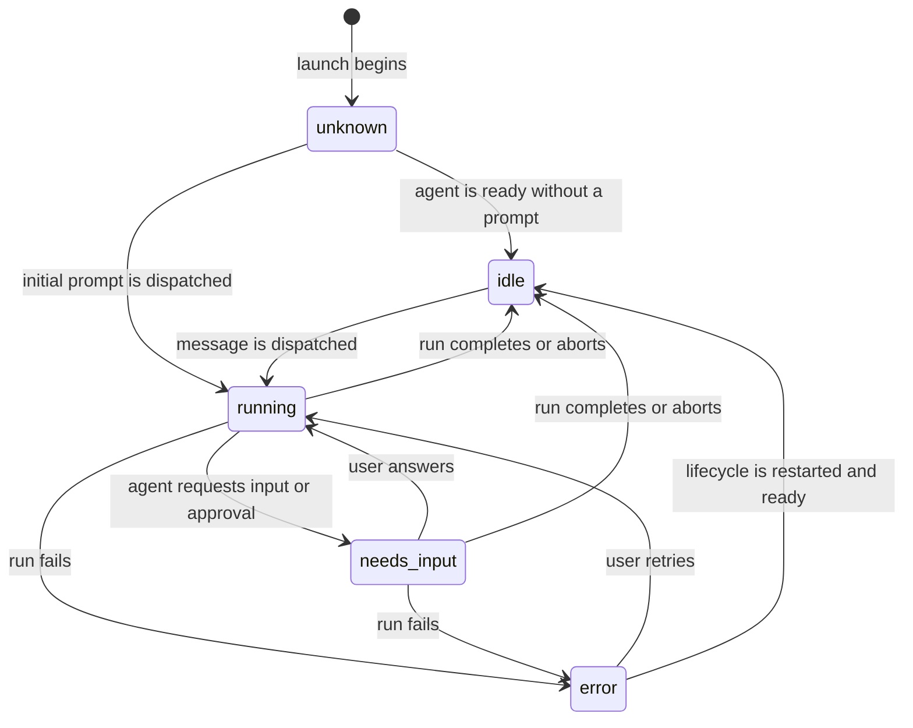

# Worker Activity Status Remediation

**Status:** Implemented on `feat/worker-activity-status-remediation`

**Scope:** Hydra core runtime semantics and Desktop status presentation

**Date:** 2026-07-20
**Related source of truth:**
[`worker-attention-control-plane-plan.md`](./worker-attention-control-plane-plan.md)

This document defines the remediation for worker and copilot status indicators
that remain animated while the underlying agent is waiting at its prompt. It
clarifies the existing Runtime v2 contract; it does not replace the worker
attention control plane.

## 1. Decision summary

Hydra must treat session lifecycle and agent activity as separate facts:

- **lifecycle** answers whether a tmux session is live or stopped;
- **runtime activity** answers whether a worker has an outstanding agent run;
- **attention** answers whether the user must act or review a result.

The implementation will make the following changes:

1. Creating, starting, or restoring a worker without dispatching a prompt
   converges to runtime `idle`, not `running`.
2. Only an actual prompt or message dispatch creates or continues a run and
   transitions runtime to `running`.
3. Completion tracking is always armed for agents with a reliable completion
   capability. The legacy `--no-notify-copilot` preference controls only
   compatibility delivery to the parent terminal, not runtime tracking or the
   global completion occurrence.
4. Existing untracked `running` snapshots are conservatively repaired to
   `unknown`, never `idle`, because terminal input can bypass lifecycle APIs.
5. Desktop animates only a genuinely running worker. Copilot liveness is
   static, normal status dots are removed from tabs, and the session header
   uses status text without a spinner.

## 2. Problem statement

### 2.1 Observed behavior

Workers that are visibly waiting at the Claude or Codex prompt can remain
`running` indefinitely in both Runtime v1 and Runtime v2. Desktop maps that
runtime state to `.hydra-sdot--running`, whose CSS animation has no terminal
condition.

The affected snapshots have this shape:

```json
{
  "state": "running",
  "origin": "lifecycle",
  "reason": "worker-started"
}
```

There is no pending completion job for these runs, so no authoritative producer
can transition them back to `idle`.

### 2.2 Root cause

`WorkerLifecycleService.prepareStartedWorker()` calls `prepareDispatch()` with
completion notification disabled. `prepareDispatch()` nevertheless creates a
run and applies a `running` transition.

The same misuse exists when a worker is created without an initial prompt.
Additionally, `notifyCompletion` currently controls both completion tracking
and parent-copilot notification. Disabling the latter therefore disables the
only normal path back to `idle`.

The current behavior violates existing control-plane decisions:

- runtime must be the current truth;
- completion intent is independent of agent hook configuration;
- `complete` returns runtime to `idle`;
- agent capability gaps must be explicit.

### 2.3 Presentation amplification

Desktop uses one presentation status in the sidebar, session tabs, and session
header. A stale `running` snapshot therefore produces multiple simultaneous
spinners. Copilots are also unconditionally mapped to `running` even though
Hydra currently exposes only copilot lifecycle, not copilot activity.

## 3. Goals

1. A worker spinner means that Hydra has an outstanding, observable agent run.
2. A worker waiting at its prompt is `idle` and visually static.
3. Start and restore do not fabricate a run.
4. `--no-notify-copilot` does not disable runtime completion tracking.
5. Existing false-running snapshots converge conservatively after upgrade
   without claiming that an unobserved worker is idle.
6. CLI, extension, sidecar, and Desktop continue to use the same core state.
7. Attention states remain prominent without duplicating normal status chrome.

## 4. Non-goals

- Inferring activity by scraping terminal text or matching an agent prompt.
- Adding `completed` to `WorkerRuntimeState`; completion remains a notification
  occurrence while runtime becomes `idle`.
- Tracking copilot turn activity in this change.
- Replacing tmux lifecycle detection.
- Changing worker identity, lifecycle epoch, or event ordering contracts.
- Adding a new transport operation solely for presentation state.
- Suppressing global worker completion history when compatibility delivery to
  a parent copilot is disabled.

## 5. State model

### 5.1 Independent dimensions

| Dimension | Values | Authority |
|---|---|---|
| Session lifecycle | `running`, `stopped` | `sessions.json` plus tmux reconciliation |
| Worker runtime | `unknown`, `idle`, `running`, `needs-input`, `error` | Runtime v2 |
| Attention/result | active completion, needs-input, error, unread count | Notification v2 |
| Copilot presentation | `Live`, `Stopped` | Copilot session lifecycle |

The word `running` in session lifecycle means “the tmux session exists.” The
word `running` in worker runtime means “an agent run is outstanding.” UI code
must not substitute one for the other.

### 5.2 Worker transitions



`runId` is `null` while a newly launched worker is ready but has never received
a prompt in the current lifecycle epoch. A completed run may retain its last
`runId` in the idle snapshot, matching the existing Runtime v2 contract.

The diagram's initial `unknown` snapshot requires a guarded initialization
rule. The coordinator currently models a missing snapshot as synthetic
`unknown` and rejects `unknown -> unknown`. This plan amends the contract to
allow an initial `unknown` snapshot only when:

- there is no snapshot in the current lifecycle epoch;
- `origin` is `lifecycle`;
- `reason` is `worker-creating`, `worker-starting`, or `worker-restoring`;
- `runId` is `null`.

Generic same-state `unknown` signals remain illegal. This initialization
amendment is distinct from the untracked-dispatch amendments in section 6.5.

### 5.3 Lifecycle operation semantics

| Operation | Prompt delivered? | Runtime after readiness |
|---|---:|---|
| Create worker without `--task` | No | `idle` |
| Create worker with `--task` | Yes | `running` until completion |
| Start inactive worker | No | `idle` |
| Restore archived worker | No | `idle` in the new lifecycle epoch |
| Send worker message | Yes | `running` until completion |
| Answer needs-input | Yes | `running` in the same run |
| Stop/delete worker | No | lifecycle `stopped`; active intent cancelled |

## 6. Core implementation

### 6.1 Separate readiness from dispatch

Refactor `packages/core/src/core/workerLifecycleService.ts` so launch readiness
does not call `prepareDispatch()`.

Introduce two explicit internal paths:

```ts
private prepareReadyWorker(
  result: CreateWorkerResult,
  reason: 'worker-created' | 'worker-started' | 'worker-restored',
): CreateWorkerResult;

private prepareDispatch(
  worker: WorkerInfo,
  reason: 'worker-initial-prompt' | 'worker-send' | string,
  options: { deliverCompatibilityToCopilot: boolean },
): PreparedWorkerDispatch;
```

`prepareReadyWorker()` performs the following sequence:

1. Cancel completion jobs outside the current lifecycle epoch.
2. Publish the guarded initial `unknown` snapshot for the new lifecycle epoch.
3. Await `postCreatePromise`.
4. Apply `idle` with `runId: null` and reason `worker-ready`.
5. If readiness fails, apply `error` through the service's injected runtime
   coordinator and then create the error occurrence with the same identity.

For a create operation with an initial prompt, readiness instead continues
through `prepareDispatch()` immediately before `deliverInitialPrompt()`.
Runtime must be `running` and completion intent must be durable before bytes are
sent to the agent, preserving the existing delivery ordering guarantee.

The old call sites change as follows:

| Current call site | Replacement |
|---|---|
| Create without initial prompt -> `prepareDispatch(..., false)` | `prepareReadyWorker(..., 'worker-created')` |
| Start -> `prepareStartedWorker()` -> `prepareDispatch(..., false)` | `prepareReadyWorker(..., 'worker-started')` |
| Restore -> `prepareStartedWorker()` -> `prepareDispatch(..., false)` | `prepareReadyWorker(..., 'worker-restored')` |
| Initial prompt | Keep dispatch path after readiness |
| Send message | Keep dispatch path |

### 6.2 Add a shared ready transition

Add `applyReadyTransition()` beside `applyRunningTransition()`. It must:

- resolve the current worker identity and lifecycle epoch;
- use revision `current + 1` for the same epoch and revision `0` for a new
  epoch;
- apply `state: 'idle'` through `WorkerRuntimeCoordinator`;
- use `runId: null` for a newly ready epoch with no dispatched run;
- project Runtime v1 through the existing coordinator path;
- emit `worker.runtime.changed` normally.

No caller may write Runtime v1 or Runtime v2 directly.

### 6.3 Centralize readiness errors

Add `applyErrorTransition()` beside the ready and running helpers. Readiness and
delivery failures must use the `WorkerLifecycleService` instance's injected
`WorkerRuntimeCoordinator` and stores; they must not call
`setWorkerRuntimeState()` through a separately composed default store.

The error sequence is:

1. Allocate an occurrence ID and an accepted runtime signal ID.
2. Apply `error` through the injected coordinator with the current worker ID,
   lifecycle epoch, run ID, and revision.
3. Create the error occurrence using the same identities.
4. Preserve `error` as runtime truth even if occurrence persistence fails.
5. Re-throw the original lifecycle error.

Refactor `publishWorkerRuntimeErrorNotification()` into a notification-only
helper or route all of its callers through the lifecycle service. The existing
`awaitWorkerPostCreateOrPublishError()` helper must no longer perform an
independent runtime write. This satisfies the existing rule that notifications
do not mutate runtime state.

### 6.4 Decouple tracking from compatibility delivery

Replace the overloaded `notifyCompletion` meaning with two internal concepts:

| Concern | Rule |
|---|---|
| Completion tracking | Always enabled when the agent adapter declares reliable completion support |
| Completion occurrence | Always created for a valid completed run |
| Parent terminal compatibility delivery | Controlled by `deliverCompatibilityToCopilot` |

Extend the completion job with an additive delivery preference:

```ts
interface CompletionJob {
  // Existing fields remain unchanged.
  deliverCompatibilityToCopilot?: boolean;
}
```

Compatibility behavior:

- an omitted value on an existing pending job is interpreted as `true`, because
  legacy jobs were armed only when compatibility delivery was enabled;
- `CompletionJobArmInput` carries an explicit boolean and new jobs always
  persist it;
- parsing and validation reject a present non-boolean value;
- the policy is immutable for one run: an adopted or reused job retains the
  value chosen by the first dispatch, and a conflicting later request is
  logged without changing the job;
- `CompletionCoordinator` always applies `idle` and creates the completion
  occurrence;
- compatibility delivery to the current parent copilot occurs only when
  `deliverCompatibilityToCopilot !== false`.

The public CLI flag remains `--no-notify-copilot` for compatibility, but its
help text is clarified to mean “do not paste the completion message into the
parent copilot terminal.” It does not suppress the durable global completion
occurrence or remove worker history from Desktop context views. No new
user-facing tracking flag is added because disabling tracking would make
runtime state knowingly incorrect.

`WorkerMessageResult.completionArmed` remains for protocol compatibility. Its
meaning becomes “runtime completion tracking was armed,” not “the parent will
be notified.”

### 6.5 Guarded `unknown` transitions

An agent without a reliable completion producer must not remain animated
forever. Hydra will represent an unobservable dispatched run as `unknown` and
surface the adapter capability in diagnostics. The dispatch still allocates a
new `runId`; the `unknown` snapshot retains it so later needs-input, error, or
manual recovery signals remain scoped to the correct run.

This requires narrow amendments to the Runtime v2 transition table:

- allow the guarded initial `unknown` snapshot defined in section 5.2;
- allow missing-current-snapshot or `idle -> unknown` for a dispatch whose
  adapter lacks completion support;
- allow `running -> unknown` and `needs-input -> unknown` only for an explicit
  `completion-tracking-unavailable` dispatch or reconciliation signal;
- reject generic or stale signals that attempt either transition.

The coordinator must enforce these transitions by current-epoch presence,
signal origin, reason, and run identity, not by making every transition to
`unknown` legal. These guarded cases are approved in the source-of-truth
control-plane document as part of this remediation.

## 7. Existing-state reconciliation

### 7.1 Conservative reconciliation rule

Add an idempotent core reconciliation pass over live persisted workers. A
snapshot is changed from `running` to `unknown` when all conditions hold:

1. its lifecycle epoch matches the current worker lifecycle epoch;
2. there is no matching pending completion job for the worker and run;
3. the worker session is live;
4. no newer current-epoch runtime signal has replaced the candidate snapshot.

The reconciler must not infer `idle`. A user can type directly into the Desktop
terminal, and that input bypasses `WorkerLifecycleService`; therefore even a
snapshot whose reason is `worker-started` may correspond to real work. The only
safe conclusion is that Hydra cannot currently observe completion for the run.
The repair does not rely on elapsed time or terminal content.

The repair signal uses:

```ts
{
  state: 'unknown',
  origin: 'lifecycle',
  reason: 'completion-tracking-unavailable',
  runId: previous.runId,
  revision: previous.revision + 1,
  signalId: `runtime-reconcile:${workerId}:${lifecycleEpoch}:${previous.signalId}`
}
```

After the repair, later reconciliation is a no-op. Runtime v1 projection and
the normal event stream update every client.

### 7.2 Diagnostic classification

The reconciler records the previous reason in structured diagnostics:

- lifecycle-only reasons such as `worker-created`, `worker-started`, and
  `worker-restored` are classified as `legacy-lifecycle-run`;
- real-dispatch reasons without a matching job are classified as
  `untracked-dispatch`;
- a matching pending job keeps the worker `running` and is not repaired.

Both ambiguous classes converge to the same static `unknown` runtime state.
The distinction is diagnostic only and must not change presentation.

### 7.3 Invocation points

Implement reconciliation once in core, but permit only the active control-plane
owner to invoke it:

- the sidecar runs reconciliation after acquiring the normal sidecar ownership
  role;
- the VS Code extension runs it only when it owns the existing sidecar-preempts-
  extension fallback role;
- CLI `list` and status commands remain read-only and never reconcile;
- a future explicit `hydra doctor --repair-runtime` command may invoke the same
  core reconciler when no long-lived owner is active.

The deterministic signal ID above, store locking, and coordinator revision
checks make takeover or crash-retry idempotent. Ownership prevents routine
read paths from emitting mutation events.

## 8. Desktop presentation

### 8.1 Shared status vocabulary

Update `packages/desktop/src/renderer/status.ts`:

- add a static `live` presentation status;
- map a live copilot to `live`, never `running`;
- continue deriving worker presentation from Runtime v2;
- keep `completed` as a derived unread-completion presentation state;
- keep `needs-input` and `error` as attention states.

### 8.2 Sidebar

The sidebar remains the primary worker activity surface:

- `running`: animated progress ring;
- `idle`: static hollow ring;
- `completed`: static success dot;
- `needs-input`: attention treatment;
- `error`: static error treatment;
- `unknown`: static neutral dot;
- `stopped`: static muted dot.

A live copilot does not receive an activity spinner. A stopped copilot may keep
a static lifecycle marker.

### 8.3 Tabs

Remove normal lifecycle/activity dots from session tabs. Render a marker only
for `needs-input` or `error`; retain an accessible label describing the current
status. The tab's normal information hierarchy becomes:

1. session kind;
2. session name;
3. exceptional attention state;
4. close action.

### 8.4 Session header

Remove the status dot from the header and retain status text:

- Copilot: `Live` or `Stopped`;
- Worker: `Running`, `Idle`, `Completed`, `Needs input`, `Error`, or `Unknown`.

This prevents a second spinner from duplicating the sidebar while preserving
the state when the sidebar is collapsed or visually distant.

### 8.5 CSS

Keep `hy-spin` only for `.hydra-sdot--running` rendered by the sidebar. Remove
the running status-dot nodes from `TabBar` and `SessionHeader`; do not solve the
problem with per-location animation overrides.

## 9. Files and ownership

| Area | Primary files | Change |
|---|---|---|
| Lifecycle semantics | `packages/core/src/core/workerLifecycleService.ts` | Split ready and dispatch paths |
| Completion policy | `packages/core/src/core/completionJobStore.ts`, `completionCoordinator.ts` | Persist and honor compatibility-delivery preference |
| Runtime authority | `packages/core/src/core/workerRuntimeCoordinator.ts` | Ready/error/reconciliation transitions and guarded unknown amendments |
| Error publication | `packages/core/src/core/workerAttentionNotifications.ts` | Remove independent runtime writes; accept lifecycle-owned identities |
| Host convergence | Sidecar bootstrap and extension fallback activation | Owner-only shared reconciliation; CLI stays read-only |
| CLI compatibility | `packages/cli/src/cli/commands/worker.ts` | Clarify `--no-notify-copilot` help text only |
| Presentation selector | `packages/desktop/src/renderer/status.ts` | Static copilot liveness and worker activity mapping |
| Sidebar | `packages/desktop/src/renderer/sidebar/TreeRow.tsx` | Animate only running workers |
| Tabs | `packages/desktop/src/renderer/tabs/TabBar.tsx` | Exceptional markers only |
| Header | `packages/desktop/src/renderer/shell/SessionHeader.tsx` | Text status, no dot |
| Styling | Desktop renderer styles | Remove duplicated spinner usage |

No protocol change is required for the basic remediation because runtime state
already reaches Desktop through Runtime v2. The optional
`deliverCompatibilityToCopilot` field is internal to the completion job store.

## 10. Failure and concurrency behavior

1. Completion intent is persisted before prompt delivery.
2. Runtime becomes `running` before prompt delivery so observers cannot miss
   the start of a run.
3. Delivery failure cancels a newly created job and applies `error` through the
   injected coordinator before publishing the error occurrence.
4. Readiness failure never publishes `idle`; it applies `error` through the
   same coordinator and lifecycle epoch.
5. A completion signal racing reconciliation wins by revision/run validation.
6. A stale-epoch hook cannot close a newly restored worker run.
7. Rename changes routing only and does not change activity.
8. Repeated owner reconciliation is idempotent through deterministic signal
   identity and revision validation.
9. Suppressing parent terminal compatibility delivery never suppresses Runtime
   v2 or the global completion occurrence.

## 11. Test plan

### 11.1 Core lifecycle smoke coverage

Extend `packages/core/src/smoke/workerLifecycleServiceSmoke.ts` with:

1. create without prompt -> `idle`, `runId: null`, no pending job;
2. start -> `idle`, no pending job;
3. restore -> new epoch and `idle`, old job cancelled;
4. create with prompt -> job pending and `running` before delivery;
5. send from idle -> new run and `running`;
6. send while needs-input -> same run and `running`;
7. compatibility delivery disabled -> job still pending and completion remains
   tracked;
8. readiness failure -> the injected Runtime v2 store contains `error`, never
   `idle`;
9. delivery failure -> job cancelled and `error`.

Add coordinator coverage for guarded initialization:

1. no current-epoch snapshot plus lifecycle `worker-starting` -> `unknown`;
2. generic initial `unknown` -> `illegal-transition`;
3. same-epoch repeated `unknown` without an approved reason ->
   `illegal-transition`.

### 11.2 Completion coverage

Extend completion job/coordinator smoke tests with:

1. suppressed compatibility delivery still transitions to `idle`;
2. suppressed compatibility delivery still creates the global completion
   occurrence;
3. legacy jobs without `deliverCompatibilityToCopilot` default to delivery;
4. malformed persisted delivery preferences fail closed;
5. an adopted/reused run keeps the first dispatch's delivery preference;
6. duplicate completion remains idempotent.

### 11.3 Reconciliation coverage

Add characterization and fixed tests for:

1. lifecycle-origin `worker-started` without a job -> `unknown`, never `idle`;
2. manually typed terminal work without a job -> `unknown`, never `idle`;
3. matching pending job prevents reconciliation;
4. stale lifecycle epoch is ignored;
5. real-dispatch running state without a job -> `unknown`;
6. Runtime v1 projection matches reconciled Runtime v2;
7. deterministic concurrent reconciliation emits at most one effective
   transition;
8. CLI list/status does not write runtime state or emit reconciliation events.

### 11.4 Desktop coverage

Extend Desktop control-state and terminal-first smoke tests:

1. live copilot maps to static `Live`;
2. copilot tab/header contain no running dot;
3. normal worker tab contains no dot;
4. needs-input/error tabs retain an attention marker;
5. worker sidebar running state uses the animated class;
6. idle/completed/stopped/unknown sidebar states do not animate;
7. header retains accessible status text without a dot.

### 11.5 Required verification

```bash
npm run compile
npm run lint
npm run smoke:worker-lifecycle-service
npm run smoke:completion-job-store
npm run smoke:completion-coordinator
npm run smoke:worker-runtime-coordinator
npm run smoke:worker-runtime-state
npm run smoke:worker-identity
npm run smoke:desktop-control-state
npm run smoke:desktop-terminal-first
```

Manual packaged-Desktop validation must cover Claude and Codex workers, start,
restore, tracked task dispatch, direct terminal input, completion, needs-input,
application restart, and sidecar-to-extension fallback ownership.

## 12. Delivery plan

### Phase 0 — Contract and characterization

- Approve this document and all guarded Runtime v2 `unknown` amendments.
- Add failing characterization for lifecycle-only false-running snapshots.
- Record current `--no-notify-copilot` behavior.

### Phase 1 — Core semantics

- Split readiness from dispatch in `WorkerLifecycleService`.
- Add ready and centralized error transitions with injected-store coverage.
- Decouple completion tracking from terminal compatibility delivery.
- Land core and completion smoke coverage.

### Phase 2 — Reconciliation

- Add the shared idempotent runtime reconciler.
- Wire sidecar-owner and extension-fallback invocation points; keep CLI reads
  pure.
- Reclassify untracked historical runs as `unknown`, never `idle`.
- Add all guarded `unknown` handling after source-of-truth approval.

### Phase 3 — Desktop presentation

- Introduce static copilot `live` presentation.
- Keep worker activity in the sidebar.
- Remove normal tab dots and all header dots.
- Retain exceptional attention markers and accessible text.

### Phase 4 — Release validation

- Run the targeted and full test suites.
- Validate a packaged Desktop restart with existing stale state.
- Confirm no regression in rename, restore, completion, or needs-input routing.

Core semantics and migration must land before the UI change. Hiding spinners
first would mask incorrect Runtime v2 state from every other client.

## 13. Acceptance criteria

The remediation is complete when all statements are true:

1. Starting or restoring a worker without a prompt never leaves it `running`.
2. A spinner appears only while an observable worker run is outstanding.
3. Claude and Codex completion stop the spinner without opening the terminal.
4. `--no-notify-copilot` suppresses only terminal compatibility delivery, not
   state tracking or global completion history.
5. Existing untracked running snapshots reconcile to static `unknown` without
   falsely claiming that manually started work is idle.
6. Restarting Hydra does not turn idle workers back into running workers.
7. Copilots never show an activity spinner until Hydra has a real copilot
   activity authority.
8. Tabs and headers do not duplicate normal sidebar status indicators.
9. Needs-input and error remain visible and accessible in all relevant views.
10. Runtime v1 compatibility, Runtime v2, events, and Desktop agree after every
    transition.

## 14. Required source-of-truth amendments

Implementation includes the approved guarded `unknown` cases in section 6.5:

1. initial lifecycle initialization when no current-epoch snapshot exists;
2. dispatch by an adapter without reliable completion capability;
3. reconciliation after completion tracking is absent or lost.

This document adopts the following notification decision: the legacy
`--no-notify-copilot` option suppresses only compatibility delivery into the
parent terminal. Durable global completion occurrences and Desktop worker
history remain available. The CLI help text and internal field names must make
that narrower meaning explicit.

These amendments are recommended because static `unknown` is more accurate
than either an indefinite `running` state or an unsafe inferred `idle` state,
and because global attention history must remain independent from legacy
terminal-message delivery.
