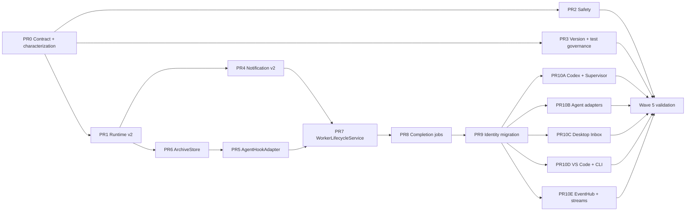

# Worker Attention Control Plane Re-architecture

**Status:** Implementation complete through Wave 5; direct promotion to `main` approved by scope owner

**Implementation gate:** Satisfied by PR #276 (`77a523a`).

**Scope owner:** Hydra core control plane

**Approved:** 2026-07-10

**Last updated:** 2026-07-11

This document is the source of truth for the notification, worker runtime,
completion, needs-input, and attention-inbox re-architecture. It supplements
`docs/control-plane-roadmap.md` and `docs/desktop-app/FINAL.md`. If either older
document conflicts with this plan for the areas above, this document governs
the implementation.

The purpose of this document is to prevent semantic drift across multiple
pull requests, clients, and agent adapters. Every implementation PR must cite
the relevant section and must not silently change a frozen decision.

## 1. Outcome

Hydra will move from best-effort notification projection to a reliable worker
attention control plane:

- runtime state is the authoritative answer to what a worker is doing now;
- notifications are durable occurrences and user interaction history;
- completion intent is persisted independently from agent hook configuration;
- CLI, VS Code, and Desktop use the same lifecycle service;
- rename and restore do not invalidate worker identity or pending work;
- Desktop can produce and consume complete, needs-input, and error signals
  without requiring the VS Code extension to be running;
- stale, duplicated, or replayed agent signals cannot regress current state.

The visible product result is a trustworthy attention inbox for parallel
workers. A user can leave several workers running and later see which workers
are running, complete, waiting for input, or failed without inspecting each
terminal.

## 2. Why this is a control-plane change

The current implementation has the necessary pieces but no single authority:

- `NotificationStore.create()` can project a notification into runtime state;
- `SessionManager`, CLI commands, Desktop sidecar code, hooks, and the Codex
  transcript monitor can each update parts of worker state;
- completion is armed through one session-named `.pending` file;
- session names are used as storage and hook identity even though rename is a
  supported operation;
- notification history is also used to reconstruct current attention;
- Desktop and the extension do not run the same producer set.

The implementation must therefore change the authority and ordering model,
not merely add more notification UI.

## 3. Frozen decisions

The following decisions are frozen for the implementation. Changing one
requires the change-control process in section 16.

1. **Controlled parallelism.** The core state chain is implemented serially.
   Independent security, version, and test work may run in parallel.
2. **Runtime is current truth.** Notification records never write runtime
   state directly.
3. **Complete is not a runtime state.** A completed run leaves runtime in
   `idle` and creates a `complete` notification occurrence.
4. **Blocked remains manual-only.** Hydra does not infer `blocked` from idle
   time, terminal text, or ambiguous agent behavior.
5. **Stable worker identity uses the existing numeric `workerId`.** Session
   name is a mutable route and display value, not a primary key.
6. **A worker lifecycle epoch changes on restore/recreation.** Signals from an
   older epoch are stale even when workerId is preserved.
7. **One active run per worker.** Sending while `running` or `needs-input`
   continues that run. Dispatching from `idle`, `error`, or `unknown` creates a
   new run.
8. **Needs-input is a pause inside a run.** Answering it resolves the active
   attention occurrence and returns the same run to `running`.
9. **Read, resolve, dismiss, and clear are different operations.** Reading or
   dismissing a notification never changes runtime state.
10. **Active attention is not subject to history retention.** Retention only
    evicts resolved or dismissed history.
11. **Workers without a parent copilot still publish global attention.** A
    parent controls routing, not whether an occurrence exists.
12. **Hooks emit signals only.** Shell or PowerShell hook scripts do not own
    lifecycle transitions, routing, dedupe, or notification construction.
13. **All user-facing clients call the same lifecycle service.** Direct
    client-specific send/create/start behavior is removed.
14. **Agent capability gaps are explicit.** Unsupported signals are reported
    as unsupported, not silently simulated.
15. **Version 2 state is introduced beside version 1 state.** Compatibility
    projection is retained for one release before version 1 writers retire.
16. **Implementation lands on a dedicated integration branch before main.**
    Logical PRs merge into `feat/worker-attention-control-plane`; only after
    the complete program passes Wave 5 are its squash commits promoted to
    `main` through dependency-ordered PRs.

## 4. Source-of-truth boundaries

| State surface | Responsibility | Must not do |
|---|---|---|
| `sessions.json` | Worker/copilot identity, mutable session route, lifecycle metadata | Infer agent attention from old notifications |
| Runtime v2 | Current worker execution state | Store inbox history or user read state |
| Completion jobs | Persist in-flight run completion intent | Render UI or mutate project hook configuration |
| Notification v2 | Occurrences, read/resolve/dismiss history, inbox queries | Project runtime state |
| Event log / EventHub | Ordered audit and wake-up/fan-out | Become the only current-state database |
| Agent adapters | Normalize native agent signals | Choose UI routing or write stores directly |

## 5. Target components

### 5.1 `WorkerRuntimeCoordinator`

The only component allowed to mutate Runtime v2. It validates signal ordering,
run identity, lifecycle epoch, and legal transitions before writing state and
emitting `worker.runtime.changed`.

### 5.2 `WorkerLifecycleService`

The shared implementation behind CLI, VS Code, and Desktop operations:

- create worker;
- start worker;
- send worker message;
- stop worker;
- delete worker;
- rename worker;
- restore worker.

It coordinates session mutation, run creation, completion arming, runtime
transitions, error publication, and event emission.

### 5.3 `CompletionJobStore`

Persists the completion intent for a worker run. It replaces session-named
`.pending` files. Jobs are keyed by worker identity and run identity.

### 5.4 `CompletionCoordinator`

Consumes normalized completion signals, validates them against the active job,
transitions runtime to `idle`, creates a `complete` occurrence, and optionally
delivers a compatibility message to the worker's current parent copilot.

### 5.5 `WorkerAttentionSupervisor`

A single leased producer that runs agent monitors which cannot be expressed as
direct hooks, including incremental Codex transcript parsing. The sidecar owns
the supervisor while running. The VS Code extension may acquire the lease only
when no sidecar supervisor owns it.

### 5.6 `AgentHookAdapter`

One adapter per supported agent. It owns capability declaration, safe hook
installation/removal, and native-event normalization. It does not write
runtime or notification stores.

### 5.7 `EventHub`

A shared incremental tailer and in-process fan-out layer. It replaces one full
event-log scan per subscriber and provides immediate cancellation.

## 6. Runtime v2 contract

```ts
type WorkerRuntimeState =
  | 'unknown'
  | 'running'
  | 'idle'
  | 'needs-input'
  | 'error';

interface WorkerRuntimeSnapshotV2 {
  version: 2;
  workerId: number;
  sessionName: string;
  lifecycleEpoch: string;
  runId: string | null;
  revision: number;
  state: WorkerRuntimeState;
  signalId: string;
  occurrenceId?: string;
  sourceSequence?: number;
  origin: 'lifecycle' | 'hook' | 'codex-transcript' | 'manual';
  reason: string;
  observedAt: string;
  agent?: string | null;
  workdir?: string | null;
}
```

### 6.1 Ordering rules

`WorkerRuntimeCoordinator.apply(signal)` returns one of:

- `applied`;
- `duplicate`;
- `stale-revision`;
- `stale-run`;
- `stale-epoch`;
- `illegal-transition`;
- `worker-not-found`.

Rules:

1. `workerId` must resolve to a current or explicitly restorable worker.
2. `lifecycleEpoch` must equal the worker's current epoch.
3. Run-scoped signals must match the active `runId`.
4. Repeated `signalId` values are idempotent.
5. A lower revision or source sequence cannot replace a newer snapshot.
6. Rejections are observable through structured logs and metrics but do not
   create user notifications by default.

### 6.2 Legal state transitions

| From | Allowed transitions |
|---|---|
| `unknown` | `running`, `idle`, `error` |
| `running` | `needs-input`, `idle`, `error` |
| `needs-input` | `running`, `idle`, `error` |
| `idle` | `running`, `error` |
| `error` | `running`, `idle` |

A same-state signal may update reason/metadata only when it has a newer
revision and a distinct signalId.

### 6.3 Run boundaries

- Dispatch from `unknown`, `idle`, or `error` creates a new UUID `runId`.
- Dispatch while `running` adds input to the current run.
- Dispatch while `needs-input` is treated as an answer, resolves the active
  needs-input occurrence, and resumes the current run.
- A valid complete signal ends the run, moves runtime to `idle`, and creates a
  complete occurrence.
- A valid abort signal ends the run and moves runtime to `idle` without
  creating a complete occurrence.
- A terminal error ends the run and moves runtime to `error`.

## 7. Notification v2 contract

```ts
type NotificationStatus =
  | 'active'
  | 'resolved'
  | 'superseded'
  | 'dismissed';

interface HydraNotificationV2 {
  version: 2;
  id: string;
  occurrenceId: string;
  workerId: number;
  lifecycleEpoch: string;
  runId: string;
  signalId: string;
  kind: 'complete' | 'needs-input' | 'error' | 'blocked' | 'info';
  status: NotificationStatus;
  title: string;
  body: string;
  createdAt: string;
  readAt: string | null;
  resolvedAt: string | null;
  dismissedAt: string | null;
  sourceSession: string;
  targetSession: string | null;
  action?: NotificationAction;
}
```

### 7.1 Occurrence and dedupe semantics

- `signalId` identifies one normalized native signal.
- `occurrenceId` identifies one user-visible attention occurrence.
- Dedupe scope is `(workerId, lifecycleEpoch, runId, signalId)`.
- Replaying the same native event is idempotent.
- The same question or error text in a later run creates a new occurrence.
- Notification dedupe never replays an old record into runtime.

### 7.2 User operations

- `markRead(id)` changes only `readAt`.
- `resolve(id, reason)` changes `status` and `resolvedAt`; normally called by a
  lifecycle transition, not directly by UI.
- `dismiss(id)` changes `status` and `dismissedAt`; runtime is unchanged.
- Compatibility `clear(scope)` creates durable tombstones and dismisses all
  matching occurrences through the current event sequence, even when the
  retained record count is zero.

### 7.3 Retention

- Active records are never evicted.
- Resolved/dismissed history is bounded by count and age.
- Scope tombstones are compacted only after all covered event segments have
  expired.
- Event replay must not reconstruct a dismissed or cleared occurrence.

## 8. Completion job contract

```ts
interface CompletionJob {
  version: 1;
  jobId: string;
  workerId: number;
  lifecycleEpoch: string;
  runId: string;
  status: 'pending' | 'fired' | 'cancelled';
  armedAt: string;
  firedAt?: string;
  cancelledAt?: string;
  cancelReason?: string;
}
```

Rules:

- There is at most one pending completion job for a worker run.
- Arming the same run is idempotent.
- Sending while a run is active does not create a second completion job.
- Rename changes only the current session route.
- Restore creates a new lifecycle epoch and cancels jobs from the old epoch.
- A stale hook cannot fire or cancel a current job.
- Hook execution resolves the worker's current session and parent at execution
  time; scripts contain no copied routing metadata.

## 9. Agent signal semantics

### 9.1 Codex

The incremental parser must understand at least:

- `task_started` -> `running`;
- `request_user_input` event -> `needs-input`;
- `response_item` function call named `request_user_input` -> `needs-input`;
- matching `function_call_output` -> resolve needs-input and return to
  `running`;
- `task_complete` / `turn_complete` -> complete and `idle`;
- `turn_aborted` -> resolve pending needs-input and move to `idle` with an
  aborted reason.

Parser cursor state includes transcript identity, byte offset, and last native
sequence/call identifier. It must not rescan the last fixed-size transcript
window on every poll.

### 9.2 Claude

Required normalized signals:

- `PermissionRequest` -> needs-input;
- `AskUserQuestion` -> needs-input;
- `ExitPlanMode` -> needs-input;
- subsequent execution/input signal -> resolve and running;
- valid Stop/completion signal -> complete and idle.

### 9.3 Other agents

Gemini, Antigravity, Sudo Code, and custom agents expose a capability matrix.
The first implementation must declare support for:

| Capability | Meaning |
|---|---|
| `complete` | Emits a reliable run completion signal |
| `needsInput` | Emits a reliable attention signal |
| `inputResolved` | Indicates that waiting has ended |
| `aborted` | Distinguishes abort from complete |
| `runtimeError` | Emits an execution error signal |

Unknown capability means unavailable, not false success.

## 10. Shared lifecycle semantics

`WorkerLifecycleService.sendWorkerMessage()` executes this transaction-like
sequence:

1. Resolve worker by workerId or current session alias.
2. Reject unknown or non-Hydra sessions.
3. Determine whether to create a new run or continue the active run.
4. Persist/confirm the completion job.
5. Apply the `running` transition through the coordinator.
6. Deliver the message through the multiplexer backend.
7. On delivery failure, cancel a newly created job, transition to `error`, and
   create an error occurrence.

Clients do not reproduce these steps.

Create/start/restore failures use the same error pipeline. Stop/delete cancel
active jobs and resolve current attention with an explicit reason. Rename only
changes route metadata and emits a rename event.

## 11. Execution plan



### Wave 0 — Contract and characterization

**PR0: this document plus failing characterization coverage**

- Approve and freeze this document.
- Add minimal reproductions for stale runtime rollback, event-only clear,
  Codex abort resolution, pending-job overwrite, symlink escape, foreign tmux
  ownership, and archive concurrency.
- Record current behavior before changing implementation.
- Keep the executable known-failure ledger in
  `smoke:worker-attention-characterization`; each fixing PR flips only its own
  scenario to `fixed`.

No production implementation begins before PR0 approval.

### Wave 1 — Three independent tracks

**PR1: Runtime v2 and coordinator**

- Add v2 runtime schema and storage.
- Add `WorkerRuntimeCoordinator`.
- Add ordering, run, and epoch guards.
- Remove notification-to-runtime writes.
- Add compatibility projection for existing clients.

**PR2: Diff and multiplexer ownership safety**

- Symlink-aware file containment.
- Regular-file and size/binary limits.
- Hydra ownership checks for stop/delete/terminal attach.
- Add `@hydra-worker-id` metadata where available.

This PR must start after any active terminal-bridge feature branch is merged or
must explicitly base on that branch. It must not overwrite unrelated terminal
work.

**PR3: Version and default-test governance**

- Discover all workspace manifests dynamically.
- Include protocol, sidecar, and loopback transport in version checks.
- Include mission-control and Desktop diff smoke tests in default `npm test`.
- Add protocol/capability compatibility smoke coverage.

PR1, PR2, and PR3 may run in parallel because their main file ownership does
not overlap.

### Wave 2 — Durable notification and persistence safety

**PR4: Notification occurrence v2**

- Add occurrence/status/read/resolve/dismiss semantics.
- Add tombstones and active-record retention.
- Remove current-attention reconstruction from unbounded event history.
- Add v1 compatibility projection.

**PR6: ArchiveStore extraction and locking**

- Move archive read/update/write into a locked store.
- Add atomic update and concurrent writer tests.

PR4 and PR6 may run in parallel.

**PR5: AgentHookAdapter and fail-closed hook configuration**

- Starts after PR6 to avoid concurrent `SessionManager` integration edits.
- Extract agent-specific hook configuration.
- Preserve valid user configuration exactly.
- Refuse to overwrite malformed existing configuration.
- Make Hydra-added entries reversible and atomically written.
- Publish capability diagnostics.

### Wave 3 — Core chain, strictly serial

**PR7: WorkerLifecycleService**

- Centralize create/start/send/stop/delete/rename/restore behavior.
- Route CLI, VS Code, and sidecar through the service.
- Standardize lifecycle error publication.

**PR8: CompletionJobStore and CompletionCoordinator**

- Replace `.pending` files.
- Convert hook scripts to structured signal ingestion.
- Resolve current routing at signal execution time.

**PR9: Stable identity migration**

- Make workerId the primary key across runtime, completion, notification, and
  events.
- Add lifecycle epoch handling.
- Add session alias compatibility and old-hook cleanup.
- Verify rename/restore migrations.

PR7, PR8, and PR9 are not parallelized. They define the shared mutation path
and intentionally build on one another.

### Wave 4 — Surface and adapter integration, parallel after PR9

**PR10A: Codex incremental parser and attention supervisor**

- Persistent parser cursor.
- Function output and abort handling.
- Single sidecar/extension producer lease.

**PR10B: Claude and other agent adapters**

- Complete capability matrix.
- Needs-input resolution and abort/error mappings where supported.

**PR10C: Desktop parent routing and complete Inbox**

- Parent copilot selector.
- Global inbox fallback.
- Complete/needs-input/error rows and actions.
- Sidecar-owned producers and lifecycle service integration.

**PR10D: VS Code and CLI convergence**

- Shared lifecycle calls.
- Read/resolve/dismiss command semantics.
- Worker scope and copilot target scope coverage.

**PR10E: Cancellable streams, EventHub, and retention**

- Immediate iterator cancellation.
- Shared notification service and one event tailer.
- Bounded/segmented event retention.
- O(new events) subscription work.

### Wave 5 — Migration and release validation

- Run v1/v2 shadow comparison.
- Exercise Desktop-only operation with VS Code closed.
- Exercise extension-only fallback with Desktop closed.
- Run rename/restore while completion and needs-input are pending.
- Run 100,000-event and notification-retention tests.
- Run macOS/Linux and Windows hook-format coverage where supported.
- Perform Extension Development Host and packaged Desktop validation.

## 12. Branching and promotion workflow

### 12.1 Canonical integration branch

The program's temporary integration branch is:

```text
feat/worker-attention-control-plane
```

`main` remains unchanged while the implementation is under construction. The
integration branch is the only place where all waves are assembled and where
cross-PR and migration validation runs.

The integration branch is shared history. Once pushed, do not rebase or
force-push it. Merge the latest `origin/main` into it at wave boundaries when
main has moved.

### 12.2 Logical implementation branches

Workers never modify the integration worktree concurrently. Each logical PR
uses its own branch and worktree, based on the latest integration branch:

```text
feat/wa-00-contract
feat/wa-01-runtime-v2
feat/wa-02-control-plane-safety
feat/wa-03-version-test-governance
...
```

Development PRs target `feat/worker-attention-control-plane`, not `main`.
Before merge, each branch rebases or merges the latest integration branch as
appropriate and reruns its gates. Use squash merge into the integration branch
so every logical PR becomes one traceable promotion commit.

Parallel work is allowed only for branches identified as parallel in section
11. Branches in the serial core chain do not start until their predecessor is
merged into the integration branch.

### 12.3 Integration freeze

After all Wave 4 work is merged:

1. Stop feature development on the integration branch.
2. Merge the latest `origin/main` into the integration branch.
3. Run all Wave 5 migration, performance, Desktop, and extension validation.
4. Fix failures on logical fix branches targeting the integration branch.
5. Record the validated integration commit in this document.

No promotion PR opens before this freeze passes.

### 12.4 Promotion to main

Promotion is sequential and dependency ordered:

1. Create `feat/wa-promote-<nn>-<scope>` from the latest `main`.
2. Cherry-pick the corresponding integration squash commit or approved group
   of independent squash commits.
3. Open a focused PR targeting `main` with the original logical PR evidence.
4. Merge it, update local `main`, and create the next promotion branch from the
   new main.
5. Rerun focused tests for every PR and the full suite at each wave boundary.

The default is one logical integration commit per promotion PR. Independent
low-risk commits may be grouped only when the PR remains reviewable and no
dependency boundary is hidden.

The integration branch itself is not opened as one large PR to `main` unless
this frozen decision is explicitly changed.

For this completed program, the scope owner approved a one-time direct
promotion after Wave 5 on 2026-07-11. The promotion PR uses the validated
integration branch as its head and a merge commit so the already-reviewed
logical squash commits remain individually traceable in `main`.

### 12.5 Review fixes during promotion

If main-PR review requires a code change, make the fix on a logical branch
targeting the integration branch first. After it merges, cherry-pick the same
fix commit into the active promotion branch. Do not create a main-only fix;
that would make the validated integration branch differ from the shipped
implementation.

After the final promotion PR merges, verify that the effective diff between
the validated integration result and main is empty, allowing only expected
commit-hash and compatibility-artifact differences. Archive the integration
branch only after that comparison passes.

## 13. Pull request gates

Every implementation PR must include:

1. The exact frozen decisions and acceptance scenarios it implements.
2. Characterization/regression tests that fail before the fix.
3. Store/protocol compatibility notes when schemas change.
4. Full diff review before publication.
5. `npm run compile`.
6. `npm run lint`.
7. Relevant focused smoke tests.
8. `npm test` before merging any core-contract PR.
9. `git diff --check`.

A PR does not merge if it changes an unrelated surface merely to make its own
tests pass.

## 14. End-to-end acceptance scenarios

The program is not complete until all scenarios pass:

1. `running -> needs-input -> running -> idle + complete occurrence`.
2. The same question in two runs creates two occurrences.
3. A stale needs-input replay cannot replace a newer running snapshot.
4. Codex `request_user_input -> function_call_output` resolves attention.
5. Codex `request_user_input -> turn_aborted` leaves no active needs-input.
6. Rename while completion is pending routes to the new session and current
   parent.
7. Restore preserves workerId but rejects hook signals from the old epoch.
8. More than 1,000 history records do not evict active attention.
9. A cleared event-only notification does not reappear after restart.
10. Desktop-only operation produces complete, needs-input, and error.
11. Repeated stream connect/disconnect returns watcher/socket counts to
    baseline.
12. Concurrent archive writers lose no entries.
13. Symlink escape, binary file, and oversized file snapshots are rejected or
    safely represented.
14. A normal user tmux session cannot be stopped, deleted, or attached through
    Hydra worker operations.
15. All workspace package versions match.

## 15. Migration and rollback

### Release N: shadow mode

- Introduce `worker-runtime-state-v2.json` and `notifications-v2.json`.
- Continue version 1 compatibility projection.
- Compare v1/v2 results through diagnostics and smoke tests.
- Write `completion-jobs.json` as the only new completion authority once PR8
  lands; old pending files remain read-only fallback for migration.

### Release N+1: version 2 authority

- Runtime v2 and Notification v2 become authoritative.
- Version 1 files are compatibility projections only.
- Old hook/pending artifacts are removed after successful worker migration.

### Later release: retirement

- Remove version 1 writers after one stable release interval.
- Retain an explicit diagnostic/export command before deleting old loaders.

Before migration, Hydra creates one-time timestamped backups of runtime,
notification, completion, and archive state. Migration writes are locked and
atomic. A failed migration leaves the original files untouched and prevents
the new writer from starting.

## 16. Drift and change control

This document is intentionally more prescriptive than a normal roadmap.

Any proposed change to a frozen decision must be made as a documentation PR
before or alongside implementation. The PR description must contain:

```text
Decision being changed:
Observed evidence:
Why the current contract cannot satisfy it:
Compatibility impact:
Migration impact:
PR dependency changes:
New acceptance scenario:
```

Implementation workers receive this document as part of their task contract.
They may narrow their PR but may not broaden it. If code reality contradicts
the plan, the worker stops at the contradiction, records evidence, and requests
a contract update instead of inventing a local exception.

After each merged wave, update only these sections:

- Status and last-updated metadata;
- the completed PR checklist;
- verified deviations approved through change control;
- validation evidence.

### Approved deviation — direct final promotion

```text
Decision being changed:
Promote one logical integration commit per main-targeting PR.

Observed evidence:
All logical PRs were individually reviewed before integration; Wave 5 passed
the full repository suite, 100,000-event and notification retention gates,
Desktop-only and extension-only runtime validation, and packaged Desktop
validation. The effective main-to-integration diff is conflict-free.

Why the current contract cannot satisfy it:
Replaying 22 already-reviewed squash commits through 22 additional serial PRs
adds repeated review latency without changing the validated code or dependency
order.

Compatibility impact:
None. The direct PR contains the same validated integration tree.

Migration impact:
None. Existing Wave 5 migration and rollback gates remain unchanged.

PR dependency changes:
The final promotion is one main-targeting PR instead of 22 serial promotion
PRs. The logical commits and their original PR evidence remain in history.

New acceptance scenario:
Merge the validated integration branch with a merge commit, then verify the
effective diff between main and the integration branch is empty and rerun the
main-branch release gates.
```

## 17. Completion checklist

- [x] PR0 contract approved and characterization tests landed (#276, `77a523a`)
- [x] PR1 Runtime v2 (#279, `4c2df4d`)
- [x] PR2 Diff/tmux ownership safety (#278, `272088e`)
- [x] PR3 Version/default-test governance (#277, `f825e5f`)
- [x] PR4 Notification v2 (#281, `d09675b`)
- [x] PR6 ArchiveStore (#282, `43b2af7`)
- [x] PR5 AgentHookAdapter (#283, `9075994`)
- [x] PR7 WorkerLifecycleService (#285, `35b529e`)
- [x] PR8 CompletionJobStore/Coordinator (#286, `d10a633`)
- [x] PR9 Stable identity migration (#287, `b558fe4`)
- [x] PR10A Codex/Supervisor (#291, `fa20754`)
- [x] PR10B Claude/agent adapters (#292, `c43d654`)
- [x] PR10C Desktop Inbox (#293, `28036a1`)
- [x] PR10D VS Code/CLI convergence (#294, `30499c9`)
- [x] PR10E EventHub/stream/retention (#295, `1068214`)
- [x] Wave 5 migration and release validation (#296, `b75ecdf`)

## 18. Validation evidence

### Wave 1 — 2026-07-10

- Validated integration commit: `4c2df4d` on
  `feat/worker-attention-control-plane`.
- PR1 passed the repository Claude Code Review workflow with no review
  comments or inline findings before squash merge.
- `npm run compile`
- `npm run lint`
- `npm run smoke:worker-runtime-coordinator`
- `npm run smoke:control-plane-safety`
- `npm run smoke:version-consistency`
- `npm run smoke:protocol-compatibility`
- `npm run smoke:mission-control`
- `npm run smoke:desktop-diff`
- `npm run smoke:worker-runtime-state`
- `npm run smoke:worker-attention-characterization`
- `env -u HYDRA_CONFIG_PATH -u HYDRA_HOME npm test`
- Characterization ledger after validation: runtime rollback, symlink escape,
  and foreign tmux ownership are `fixed`; the remaining entries stay
  `known-failure` for their owning waves.
- No frozen decision or PR dependency was changed during Wave 1.

### Wave 2 — 2026-07-10

- Validated integration commit: `9075994` on
  `feat/worker-attention-control-plane`.
- PR4, PR6, and PR5 each passed the repository Claude Code Review workflow
  with no review comments or inline findings before squash merge.
- `npm run compile`
- `npm run lint`
- `npm run smoke:notification-v2`
- `npm run smoke:archive-store`
- `npm run smoke:agent-hook-adapter`
- `npm run smoke:completion-hook`
- `npm run smoke:notify-hook-windows`
- `npm run smoke:cli-contract`
- `npm run smoke:worker-delete`
- `npm run smoke:task-worker`
- `npm run smoke:worker-attention-characterization`
- `env -u HYDRA_CONFIG_PATH -u HYDRA_HOME npm test`
- Notification v2 is authoritative for occurrence status while retaining a
  recoverable version 1 compatibility projection. Active attention is not
  evicted by terminal-history retention.
- The archive schema remains unchanged. Archive updates are now locked,
  validated, and atomically replaced without losing concurrent writers.
- Agent hook JSON schemas remain unchanged. Malformed user configuration is
  rejected without replacement, Codex TOML is not mutated, and Hydra-owned
  entries are reversible through persisted install receipts.
- Characterization ledger after validation: runtime rollback, event-only
  notification clear, symlink escape, foreign tmux ownership, and archive
  concurrency are `fixed`. Codex abort resolution and completion pending-job
  overwrite remain `known-failure` for their owning waves.
- No frozen decision or PR dependency was changed during Wave 2.

### Wave 3 — 2026-07-10

- Validated integration commit: `d7ddcc1` on
  `feat/worker-attention-control-plane`.
- PR7, PR8, and PR9 each passed the repository Claude Code Review workflow
  with no review comments or inline findings before squash merge.
- Follow-up PR #288 (`d7ddcc1`) added retry handling for macOS `ENOTEMPTY`
  races during temporary-directory cleanup. Its Claude Code Review also passed
  with no review comments or inline findings.
- `npm run lint`
- `env -u HYDRA_CONFIG_PATH -u HYDRA_HOME npm test`
- `git diff --check`
- Worker create, start, send, stop, delete, rename, restart, and restore
  mutations now converge through `WorkerLifecycleService`, with lifecycle
  errors published consistently.
- Completion intent now uses locked, atomic `completion-jobs.json` records and
  `CompletionCoordinator` claim/finalize recovery instead of `.pending` files.
  Hook signals are structured inputs whose current routing is resolved when
  the signal is processed.
- Worker identity is now keyed by durable `workerId` and lifecycle epoch across
  runtime, completion, notification, and events. Session aliases preserve
  compatibility across rename, restart, and restore, while stale hooks and
  pending legacy state are cleaned up through a one-time fail-closed migration.
- Characterization ledger after validation: completion pending-job overwrite
  joins runtime rollback, event-only notification clear, symlink escape,
  foreign tmux ownership, and archive concurrency as `fixed`. Codex turn abort
  resolution remains `known-failure` for PR10A.
- No frozen decision or PR dependency was changed during Wave 3.

### Wave 4 — 2026-07-11

- Validated integration commit: `1068214` on
  `feat/worker-attention-control-plane`.
- PR10A through PR10E each passed the repository Claude Code Review workflow
  with no ordinary comments or inline findings before squash merge.
- PR10A added the incremental Codex transcript parser and a leased attention
  supervisor shared by the sidecar and extension fallback producer.
- PR10B normalized Claude hook needs-input, resolution, completion, abort, and
  error signals through the same coordinator path.
- PR10C added the Desktop global attention inbox and parent-aware routing while
  preserving global occurrences for workers without a copilot parent.
- PR10D converged VS Code and CLI read, resolve, dismiss, clear, and open
  semantics on the shared notification service.
- PR10E added one shared `EventHub`, cancellable subscriptions, a single
  external-writer tailer, bounded in-memory replay, and segmented event-log
  retention with sequence-gap recovery.
- `npm run lint`
- `env -u HYDRA_CONFIG_PATH -u HYDRA_HOME npm test`
- No frozen decision or PR dependency was changed during Wave 4.

### Wave 5 — 2026-07-11

- Validated integration commit: `b75ecdf` on
  `feat/worker-attention-control-plane`.
- PR #296 passed the repository Claude Code Review workflow with no ordinary
  comments or inline findings before squash merge.
- Added `smoke:wave5-migration` to the default `npm test` contract. It verifies
  a 100,000-event segmented log, cursor reads and EventHub replay ordering, a
  100,000-notification v2 store with active-attention preservation and bounded
  terminal history, durable signal receipts, and v1/v2 shadow equivalence
  across create, read, resolve, dismiss, restart, and clear.
- Rename/current-route completion and restore/stale-epoch coverage passed in
  `smoke:completion-coordinator` and `smoke:worker-identity`; active
  needs-input and completion producer paths passed in the Codex supervisor,
  Claude hook coordinator, and sidecar seam smokes.
- The combined pending-work scenario found and fixed an active-attention route
  gap: rename now migrates active v2 and v1 compatibility `sourceSession` and
  action routes while preserving the run and completion job. Restore cancels
  the old completion intent and resolves old-epoch needs-input attention.
- Desktop-only validation ran the fresh packaged app with VS Code closed and
  an isolated Hydra home/tmux socket. The packaged main, renderer, and bundled
  sidecar remained live; the loopback listener bound to `127.0.0.1`; the
  attention lease heartbeated with `ownerKind: sidecar`; quitting the app also
  terminated the sidecar.
- Extension-only validation ran with all Hydra Desktop processes closed. VS
  Code loaded the development extension from `packages/extension`, activated
  `zhoujinjing.hydra-code` through `onView:hydraCopilots`, registered the Hydra
  command set, and heartbeated the attention lease with
  `ownerKind: extension`.
- Corrected the `test-hydra` skill and isolated-runner example to use the
  monorepo extension path at `packages/extension` and disable installed user
  extensions during validation.
- macOS/Linux shell and Windows PowerShell hook formats passed their quoting,
  wrapper, and end-to-end smokes.
- `npm run compile`
- `npm run lint`
- `git diff --check`
- `npm run smoke:wave5-migration`
- `npm run smoke:notification-v2`
- `npm run smoke:event-hub`
- `npm run smoke:completion-coordinator`
- `npm run smoke:worker-identity`
- `npm run smoke:worker-attention-supervisor`
- `npm run smoke:agent-hook-event-coordinator`
- `npm run smoke:seam`
- `npm run smoke:windows-format-quoting`
- `npm run smoke:notify-hook-windows`
- `npm run smoke:shell-quote`
- `npm run verify:shell-quoting`
- `env -u HYDRA_CONFIG_PATH -u HYDRA_HOME npm test`
- `npm run desktop:build`
- `npm run desktop:boot-check`
- `npm run dist:mac -w @hydra/desktop`
- Packaged artifacts:
  `packages/desktop/dist/Hydra-0.3.2026062800-arm64.dmg` and
  `packages/desktop/dist/Hydra-0.3.2026062800-arm64-mac.zip`.
- No frozen decision or PR dependency was changed during Wave 5.
